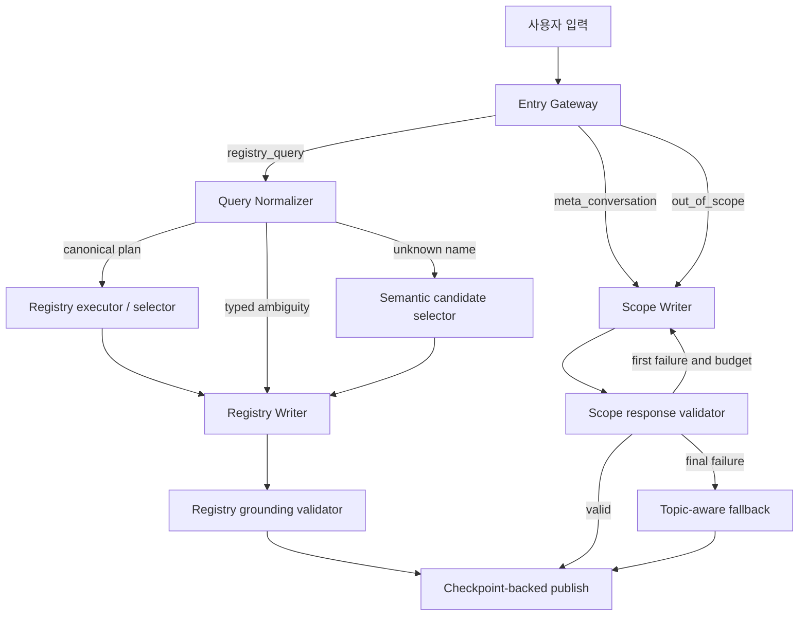

# Registry-First Input Flexibility and Scope Writer Redesign PRD

- 상태: 구현 인계용 승인 설계
- 작성일: 2026-08-10
- 대상 저장소: `C:\Users\ksy0823\.vscode\LangGraph`
- 선행 문서: `ONE_TIME_LLM_GATEWAY_DUAL_WRITER_PRD.md`
- 구현 주체: 이 문서를 이어받는 메인 Codex 세션

## 1. 문서 목적과 우선순위

현재 챗봇은 모든 입력을 strict LLM Gateway로 구조화하고 Registry Writer 또는
General Writer가 답한다. 레지스트리 사실을 강하게 보호한다는 목표는 달성했지만,
실제 PR 프리뷰에서 자연스러운 한국어 질문이 불필요한 clarification이나 시스템
장애 문구로 끝나는 문제가 확인되었다.

이 문서는 다음 변경을 한 번에 구현하기 위한 제품·기술 계약이다.

1. 역량 관련 자연어를 더 작은 Gateway 초안과 결정적 Python 표준화기로 처리한다.
2. 의미가 하나로 확정되는 질의는 안전하게 자동 보정한다.
3. 일반 지식에 답하는 General Writer 역할을 제거한다.
4. 인사·기능 안내와 범위 밖 질문만 처리하는 Scope Writer를 둔다.
5. 범위 밖 질문은 실패가 아니라 정상적인 범위 안내 응답으로 종료한다.

이 문서는 위 변경 범위에서 `ONE_TIME_LLM_GATEWAY_DUAL_WRITER_PRD.md`보다
우선한다. 선행 문서의 registry grounding, stable ID, 호출 예산, checkpoint,
SSE 일치, 비밀정보 비노출 계약은 이 문서에서 명시적으로 변경하지 않는 한 그대로
유지한다. 선행 문서는 삭제하거나 수정하지 않는다.

## 2. 사용자 관찰 문제

PR 프리뷰에서 다음 입력이 기대와 다르게 처리되었다.

| 입력 | 현재 결과 | 기대 결과 |
|---|---|---|
| `하위요인은 총 몇 개야?` | 일반적인 조건 재확인 | 필기검사의 공식 하위요인 개수를 동적으로 집계 |
| `전체 하위요인의 개수가 궁금해` | 일반적인 조건 재확인 | 위 질문과 같은 표준 질의로 처리 |
| `정의감은 뭐야?` | 일반적인 조건 재확인 | 미등록 이름 안내와 검증된 후보 또는 구체화 요청 |
| `오늘이 며칠이야?` | 공통 시스템 장애 문구 | 날짜를 답하지 않고 질문에 맞춘 부드러운 범위 안내 |
| `지금 몇 시야?` | 공통 시스템 장애 문구 | 시각을 답하지 않고 질문에 맞춘 부드러운 범위 안내 |

원인은 LLM의 자유도가 단순히 낮아서가 아니다.

- Gateway가 route 선택과 동시에 필드가 많은 `ParsedRegistryQuery` 전체를 정확하게
  작성해야 한다.
- LLM이 `hierarchy_tiers`, `node_types`, `scope` 등을 조금만 잘못 조합해도 Python
  검증이 전체 질의를 거부한다.
- 검증 오류가 사용자에게 동일한 일반 clarification으로 축약된다.
- General Writer의 범위 밖 답변 검증이 자연어 문장 전체를 좁은 표현 규칙으로
  검사해 정상적인 거절도 실패로 처리할 수 있다.
- 기본 테스트는 Gateway 결과를 stub으로 주입하므로 실제 모델의 한국어 표현
  수용성을 직접 검증하지 않는다.

## 3. 확정된 제품 결정

### 3.1 지식 범위

이 챗봇은 역량 레지스트리 전용 챗봇이다. 다음 실질적 지식만 제공한다.

- active registry에 등록된 이름, 별칭, 정의와 메타데이터
- 목록, 위계, 관계, 집계와 비교
- 행동 설명을 통한 등록 역량 후보 탐색
- 등록 사실과 명확히 분리된 비개인화 역량 활용 제안

날짜, 시각, 날씨, 뉴스, 일반 개념, 코딩, 외부 작업, 의료·법률·금융 조언 등은
직접 답하지 않는다. 웹 검색이나 시계 도구도 이번 범위에 추가하지 않는다.

### 3.2 지원되는 사회적·메타 대화

다음 입력은 지원 범위 안의 대화로 유지한다.

- 인사
- 감사와 짧은 작별
- 챗봇 소개
- 챗봇이 지원하는 기능과 사용법

이 응답도 최종적으로 역량 질문을 자연스럽게 제안할 수 있다. 일반적인 small talk와
시사성이 없는 일반 개념 설명은 지원 범위에서 제거한다.

### 3.3 범위 밖 응답

범위 밖 질문은 질문 내용에 답하지 않는다. 대신 Scope Writer가 매번 새롭게 다음
세 기능을 수행한다.

1. 사용자가 요청한 주제를 구체적으로 반영한다.
2. 해당 주제가 챗봇의 지원 범위 밖임을 자연스럽게 설명한다.
3. 현재 대화와 어울리는 역량 관련 질문으로 유도한다.

세 기능은 고정 문구가 아니라 의미 계약이다. 동일 질문에도 최근 대화를 참고해
표현과 문장 스타일이 달라질 수 있어야 한다. 하나의 공통 거절 스크립트를 정상
응답으로 사용하지 않는다.

### 3.4 미등록 역량처럼 보이는 용어

`정의감은 뭐야?`처럼 역량명 형태이지만 active registry에 없는 용어는 일반
개념으로 정의하지 않는다.

1. 정식 이름과 별칭을 확인한다.
2. 검증된 의미 후보가 있으면 최대 3개를 제시한다.
3. 유력한 후보가 없으면 미등록 이름임을 알린다.
4. 정확한 역량명 또는 관찰한 행동 특징을 더 설명해 달라고 요청한다.

Writer는 레지스트리에 없는 정의를 만들 수 없다.

### 3.5 안전한 자동 보정

질문의 의미가 하나로 확정되면 Gateway 초안에 사소한 누락이나 불일치가 있어도
Python 표준화기가 canonical query plan을 만든다. 둘 이상의 해석이 실제로 가능한
경우에만 구체적인 clarification을 요청한다.

### 3.6 복구 정책

Scope Writer의 첫 출력이 구조나 안전 검증에 실패하면 남은 호출 예산 안에서 한 번
재생성한다. 다시 실패하면 질문 주제와 분류를 반영한 안전한 범위 안내를 Python이
렌더링한다. 이 복구는 정상 범위 안내 응답이며 시스템 장애로 표시하지 않는다.

공통 고정 장애 문구는 Gateway 자체 실패, 공급자 오류 또는 안전한 route를 전혀
확정할 수 없는 실제 시스템 실패에만 사용한다.

## 4. 목표

1. 자연스러운 동의 표현을 같은 canonical registry plan으로 수렴시킨다.
2. 명백한 역량 질문을 generic clarification으로 보내는 비율을 낮춘다.
3. 불명확한 질문에는 무엇을 확인해야 하는지 구체적으로 묻는다.
4. 미등록 용어와 범위 밖 일반 질문을 서로 다른 정상 경로로 처리한다.
5. 범위 밖 질문에 직접 답하지 않으면서도 입력 맞춤형 대화를 제공한다.
6. registry 정의·이름·개수·관계·순서 grounding을 약화하지 않는다.
7. 한 턴의 실제 LLM API 요청 상한 3회를 유지한다.
8. SSE, checkpoint, history와 비스트리밍 최종 답변의 일치를 유지한다.

## 5. 비목표

- 범용 질의응답 챗봇으로 확장
- 실시간 날짜·시각·날씨·뉴스 제공
- 웹 검색, 외부 도구 또는 RAG 추가
- 사용자 개인 점수, 진단, 채용 또는 직무 적합 판단
- 의료·법률·금융 전문 조언
- registry grounding validator의 전반적 완화
- UI 재설계
- 레지스트리 DB schema 또는 활성화 절차 변경
- 다중 프로세스 분산 잠금이나 사용자 인증 추가

## 6. 핵심 용어

- **Entry Gateway**: 사용자 입력을 처음 읽고 세 가지 큰 route와 제한된 의미 초안만
  반환하는 LLM 노드다.
- **Registry draft**: 아직 권위가 없는 LLM 해석 힌트다. stable ID나 최종 필터를
  확정하지 않는다.
- **Query Normalizer**: raw query, Gateway 초안, active registry와 이전 stable-ID
  문맥으로 canonical `RegistryQueryPlan`을 만드는 결정적 Python 모듈이다.
- **Canonical plan**: 기존 registry executor가 실행할 수 있는 검증된 stable-ID
  질의 계획이다.
- **Scope Writer**: 지원되는 메타 대화와 범위 밖 안내만 작성하는 Answer 모델이다.
  일반 지식에 답하는 권한은 없다.
- **Topic-aware fallback**: Scope Writer가 복구되지 않을 때 category와 안전하게
  정리된 주제를 사용해 만드는 결정적 범위 안내다.
- **Fixed failure**: 실제 시스템 실패에만 사용하는 기존 공통 장애 안내다.

## 7. 목표 아키텍처



정상 `START` 다음 노드는 계속 Entry Gateway다. Python fast path를 Gateway 앞에
두지 않는다. 자동 보정은 Gateway 호출 이후 Query Normalizer에서 수행한다.

## 8. Entry Gateway 계약

### 8.1 route 축소

Gateway가 반환할 정상 route는 세 개뿐이다.

- `registry_query`
- `meta_conversation`
- `out_of_scope`

기존 `general_conversation`, `capability_help`, `unsupported`,
`needs_clarification`의 최상위 분기를 위 세 route로 재구성한다.

- `greeting`, `thanks`, `farewell`, `bot_identity`, `capability_help`는
  `meta_conversation`의 하위 kind다.
- 기존 `small_talk`, `simple_concept`는 제거한다.
- registry ambiguity는 Gateway가 최종 확정하지 않고 Query Normalizer가 typed
  issue로 판단한다.
- `fixed_failure`는 Gateway 출력 enum이 아니라 내부 복구 상태다.

### 8.2 OpenAI strict schema

OpenAI Structured Outputs의 root object 계약을 유지한다. 최상위
`GatewayDecision`은 `{decision: ...}` object이며 union은 `decision` 아래에 둔다.
외부 schema는 root `type=object`, `additionalProperties=false`, top-level
`anyOf`/`oneOf` 없음 조건을 만족해야 한다. 반환 뒤에는 route discriminator로 다시
엄격 검증한다.

아래는 개념적 목표 shape다. 필드명은 저장소 관례에 맞춰 조정할 수 있지만 의미와
책임을 넓혀서는 안 된다.

```python
RegistryIntentHint = Literal[
    "item_lookup",
    "semantic_search",
    "catalog_query",
    "hierarchy_query",
    "relation_query",
    "aggregate_query",
    "comparison_query",
]

ConstraintKind = Literal[
    "instrument",
    "node_type",
    "hierarchy_tier",
    "relation",
    "field",
    "scope",
    "filter",
    "group_by",
]

class ConstraintMention(StrictModel):
    kind: ConstraintKind
    text: StrictStr  # 사용자가 실제로 쓴 짧은 표현

class ScopeTopic(StrictModel):
    category: Literal[
        "date_time",
        "weather",
        "news_current_events",
        "professional_advice",
        "personal_assessment",
        "employment_decision",
        "general_knowledge",
        "external_action",
        "unsafe",
        "other",
    ]
    summary: StrictStr  # 답이 아닌 짧은 주제 명사구

class RegistryQueryDraft(StrictModel):
    intent_hint: RegistryIntentHint
    target_mentions: list[StrictStr]
    constraint_mentions: list[ConstraintMention]
    semantic_description: StrictStr | None
    reuse_previous_result: StrictBool
    answer_mode: Literal[
        "registry_facts",
        "registry_facts_with_general_guidance",
    ]
    acknowledge_greeting: StrictBool
    out_of_scope_remainder: ScopeTopic | None

class RegistryRouteDecision(StrictModel):
    route: Literal["registry_query"]
    draft: RegistryQueryDraft

class MetaRouteDecision(StrictModel):
    route: Literal["meta_conversation"]
    kind: Literal[
        "greeting",
        "thanks",
        "farewell",
        "bot_identity",
        "capability_help",
    ]

class OutOfScopeRouteDecision(StrictModel):
    route: Literal["out_of_scope"]
    topic: ScopeTopic
```

Gateway가 canonical name, stable ID, 정확한 tier enum 또는 최종 필터의 권위가 되지
않는다. `target_mentions`와 constraint `text`는 가능한 한 사용자 입력의 span을
보존한다. 이름과 제약의 의미는 Query Normalizer가 active registry와 domain
lexicon으로 확정한다.

### 8.3 route 우선순위

1. 인사와 역량 질문이 함께 있으면 `registry_query`와
   `acknowledge_greeting=true`다.
2. 역량 질문과 범위 밖 요청이 함께 있으면 `registry_query`를 우선하고
   `out_of_scope_remainder`를 채운다.
3. 이름은 없지만 행동 특징으로 등록 역량을 찾는 질문은 `registry_query`의
   `semantic_search`다.
4. 역량명처럼 보이는 미등록 용어의 정의 요청도 `registry_query`다. 일반 개념으로
   보내지 않는다.
5. 인사·감사·작별·소개·기능 안내만 `meta_conversation`이다.
6. 그 밖의 실질적인 비역량 질문은 종류와 관계없이 `out_of_scope`다.

## 9. Query Normalizer 계약

### 9.1 위치와 인터페이스

질의 표준화 로직은 `competency_query.py`의 도메인 로직으로 둔다. LangGraph state나
Writer prompt에 의존하지 않는 순수 인터페이스를 제공한다.

개념적 인터페이스:

```python
normalize_registry_query(
    *,
    raw_query: str,
    draft: RegistryQueryDraft,
    snapshot: RegistrySnapshot,
    previous_result_ids: list[str],
) -> RegistryNormalizationResult
```

`RegistryNormalizationResult`는 다음 중 정확히 하나를 가진다.

- 검증된 `RegistryQueryPlan`
- typed clarification issue와 공개 가능한 선택지
- 검증된 semantic candidate 탐색 요청
- 미등록 이름 결과

### 9.2 권위와 우선순위

표준화의 권위 순서는 다음과 같다.

1. active registry의 canonical names, aliases, instrument와 hierarchy
2. raw user query에 명시된 표현
3. 재검증된 이전 stable-ID 결과
4. 결정적 domain lexicon과 문법
5. Gateway draft hint

Gateway draft가 raw query의 명시적 제약과 충돌하면 draft를 맹신하지 않는다. raw
query와 registry로 한 가지 plan이 확정될 때만 자동 보정한다. 사용자가 명시한
제약을 조용히 삭제하거나 조회 범위를 넓혀서는 안 된다.

### 9.3 표준화 단계

1. 공백, `_`, `-`, 일반적인 한국어 조사와 문장부호를 안전하게 정규화한다.
2. 긴 canonical name과 alias부터 stable ID로 해석하고 중복을 제거한다.
3. 기존 `detect_deterministic_query`의 검증된 규칙을 Gateway 이후 fast
   canonicalization으로 재사용·확장한다.
4. tier, relation, scope, field, aggregate와 group 표현을 domain lexicon으로
   canonical enum에 매핑한다.
5. Gateway hint와 raw query를 합쳐 가능한 canonical plan을 만든다.
6. 기존 `validate_parsed_query` 및 registry 구조 검증을 통과시킨다.
7. valid plan이 하나면 실행한다.
8. valid plan이 여러 개면 차이를 설명하는 typed clarification을 만든다.
9. valid plan이 없고 미등록 target이 있으면 candidate/unregistered 경로로 보낸다.
10. 서로 모순되는 명시 조건은 구체적인 conflict clarification으로 보낸다.

### 9.4 자동 보정 허용 범위

다음은 한 가지 의미로 확정될 때 자동 보정한다.

- `하위요인`, `하위 요인`, `전체 하위요인`
- `총 몇 개`, `총 개수`, `개수가 궁금해`, `수는?`
- target이 없는 `상위/중위/하위/최하위요인`을 필기검사 공식 tier로 해석
- target이 있는 `<역량>의 상위요인/하위요인`을 직접 parent/children으로 해석
- `모든 상위/하위`를 ancestors/descendants로 해석
- `속한 중위요인` 같은 표현을 related tier로 해석
- 등록된 정식 이름과 별칭의 표기 변형
- 명시적인 `그중`, `이전 결과에서`의 stable-ID follow-up
- 목록과 집계 표현의 일상적인 어순 변화

예시 두 문장은 모두 아래 의미의 같은 plan이어야 한다.

```text
하위요인은 총 몇 개야?
전체 하위요인의 개수가 궁금해
```

```text
intent = aggregate_query
instrument = 필기 역량검사
hierarchy_tier = lower
scope = all
```

개수 자체는 코드나 prompt에 하드코딩하지 않고 active snapshot에서 계산한다.

### 9.5 자동 보정 금지 범위

다음은 한 항목을 임의 선택하지 않는다.

- 서로 다른 canonical names가 비슷한 미등록 표현과 같은 수준으로 가까운 경우
- parent와 ancestors, children과 descendants 중 사용자 표현만으로 확정할 수 없는
  경우
- 공식 tier와 target-relative 구조 관계가 실제로 충돌하는 경우
- 여러 검사에 같은 표시 용어가 있지만 어느 검사를 뜻하는지 확정할 수 없는 경우
- 이전 결과가 없거나 retired stable ID만 남은 follow-up
- 비교 대상이나 subtree 시작점이 부족한 경우

### 9.6 typed clarification

generic `질문의 대상이나 조건을 다시 확인해 주세요`를 정상 기본값으로 사용하지
않는다. 최소한 다음 issue code를 구분한다.

- `missing_target`
- `unknown_target`
- `ambiguous_target`
- `ambiguous_relation`
- `ambiguous_scope`
- `conflicting_constraints`
- `missing_previous_result`
- `unknown_instrument`
- `unsupported_registry_combination`

각 issue는 공개 가능한 canonical names 또는 선택지와 사용자에게 확인할 한 가지
차이를 포함한다. Registry Writer가 이 구조를 자연스러운 한 질문으로 표현한다.
stable ID, enum 이름과 내부 plan은 공개하지 않는다.

## 10. 미등록 이름과 semantic candidate

1. exact name 또는 alias이면 일반 item lookup으로 처리한다.
2. 미등록 target이면서 의미 후보를 찾을 정보가 있으면 기존 semantic selector를
   사용한다.
3. selector는 active registry catalog 밖의 이름을 반환할 수 없다.
4. 고확신 단일 후보만 기존 계약에 따라 자동 선택할 수 있다.
5. 다중 또는 중간 확신 후보는 검증된 최대 3개만 제시한다.
6. 후보가 없으면 미등록 사실과 다음 입력 방법을 안내한다.
7. 어떤 경우에도 미등록 용어의 일반 정의를 만들지 않는다.

`정의감은 뭐야?`가 active registry의 exact name/alias가 아니라는 전제에서는 일반
사전식 정의를 답하지 않는다. 검증된 후보가 없다면 정확한 역량명 또는 행동 특징을
요청한다.

## 11. Scope Writer 계약

### 11.1 역할

기존 `write_general_answer`와 General Writer의 일반 지식 답변 역할을 제거한다.
새 `write_scope_answer` 노드는 다음 mode만 처리한다.

- `greeting`
- `thanks`
- `farewell`
- `bot_identity`
- `capability_help`
- `out_of_scope`

Scope Writer는 `OPENAI_ANSWER_MODEL`을 사용한다. 일반 개념, 최신 정보, 외부 작업과
전문 조언을 직접 답하는 mode는 존재하지 않는다.

### 11.2 입력

Scope Writer 입력은 최소한 다음을 포함한다.

- 현재 raw query
- meta kind 또는 검증된 `ScopeTopic`
- 단일 `CAPABILITY_MANIFEST`
- 최근 user/assistant 대화 최대 12개
- 최근 Scope Writer 답변 중 표현 중복을 피하는 데 필요한 부분
- 사용자 언어를 따르라는 지침

DB 정보, stable ID, registry 원문 정의, 내부 graph route 이름과 환경변수는 넣지
않는다.

### 11.3 생성형 출력

범위 밖 응답은 전체 문구를 LLM이 생성한다. 단일 고정 prose template을 정상
응답으로 사용하지 않는다. 다만 필수 의미를 안정적으로 확인할 수 있도록 strict
structured output을 사용한다.

개념적 shape:

```python
class OutOfScopeResponseDraft(StrictModel):
    acknowledgement: StrictStr
    scope_boundary: StrictStr
    registry_redirect: StrictStr

class MetaResponseDraft(StrictModel):
    response: StrictStr
    registry_redirect: StrictStr
```

세 `OutOfScopeResponseDraft` 필드의 문구는 모두 자유롭게 생성한다.

- `acknowledgement`: 질문 주제를 짧고 구체적으로 반영하되 질문의 답을 주지 않는다.
- `scope_boundary`: 이 챗봇의 registry-only 범위를 자연스럽게 설명한다.
- `registry_redirect`: 사용자가 바로 이어서 물을 수 있는 역량 질문을 제안한다.

최종 문장은 필드 순서를 보존해 자연스럽게 결합한다. 같은 thread의 최근 Scope
답변과 문장 시작, 표현, 예시를 그대로 반복하지 않도록 prompt에 명시한다. 출력은
기본적으로 2~4문장, 전체 1,000자 이하로 제한한다.

### 11.4 meta 응답

- 인사·감사·작별은 자연스럽고 짧게 답한다.
- bot identity와 capability help는 `CAPABILITY_MANIFEST`에 있는 기능과 제한만
  설명한다.
- 적절한 경우 역량 정의, 위계, 관계, 집계 또는 행동 기반 후보 찾기 예시로
  연결한다.
- 일반 지식 질문에 답할 수 있다고 주장하지 않는다.

### 11.5 범위 밖 응답 안전 규칙

Scope Writer는 다음 목표 출력을 생성한다.

- 사용자 요청의 주제를 인식했다는 느낌을 준다.
- 요청한 사실, 수치, 판단, 절차 또는 조언은 제공하지 않는다.
- 지원 범위 설명은 변명이나 시스템 오류처럼 쓰지 않는다.
- `다시 시도해 주세요` 같은 장애 표현을 정상 범위 안내에 사용하지 않는다.
- registry capability로 자연스럽게 전환한다.
- 사용자의 언어를 따른다.

## 12. Scope response 검증

### 12.1 검증 원칙

기존처럼 특정 한국어 거절 문구 전체를 full-match하는 allowlist를 만들지 않는다.
자연스러운 표현을 허용하면서 다음을 계층적으로 검증한다.

1. strict schema와 필수 필드
2. 필드별 nonblank와 전체 길이
3. 내부 정보·비밀·route enum 비노출
4. capability manifest 밖 기능 주장 차단
5. category별 직접 답변과 위험 조언 차단
6. 사용자에게 공개할 수 있는 최종 문자열 구성

특정 단어가 없다는 이유만으로 정상적인 영어·한국어 거절을 실패시키지 않는다.
반대로 거절 문구가 포함됐다는 이유만으로 앞이나 뒤의 실제 답변·조언을 허용하지
않는다.

### 12.2 category별 직접 답변 차단

- `date_time`: 날짜·시각 값, 시간대 추측과 현재 시각 단정을 거부한다.
- `weather`: 기온, 강수, 맑음·흐림 등 현재 날씨 단정을 거부한다.
- `news_current_events`: 최신 사건이나 인물 상태의 사실 단정을 거부한다.
- `professional_advice`: 의료·법률·금융의 실행 지시, 용량, 매수·매도와 법적 판단을
  거부한다.
- `personal_assessment`: 사용자 점수, 수준, 진단과 성향 단정을 거부한다.
- `employment_decision`: 채용, 합격, 직무 적합과 추천 판단을 거부한다.
- `external_action`: 파일·이메일·예약·구매 등 실제 수행을 주장하지 않는다.
- `unsafe`: 위험 행동을 돕는 절차를 제공하지 않는다.

검사는 문장 전체와 각 clause를 모두 본다. 안전 문구가 같은 문장에 있다는 이유로
위험하거나 사실적인 clause를 통과시키지 않는다.

### 12.3 버퍼링

Scope Writer의 raw token은 사용자에게 바로 공개하지 않는다. strict draft와 최종
문장을 모두 검증한 뒤에만 공개한다. 따라서 기존 General Writer의 live raw delta
경로는 제거한다.

## 13. Scope Writer 복구와 fallback

1. Gateway 성공 뒤 첫 Scope Writer 요청을 수행한다.
2. 구조·길이·안전 검증에 실패하면 공개하지 않는다.
3. 남은 호출 예산이 있으면 같은 mode와 실패 원인을 내부적으로 반영해 한 번
   재생성한다.
4. 두 번째도 실패하거나 호출 예산이 없으면 `ScopeTopic` 기반 topic-aware
   fallback을 렌더링한다.
5. fallback은 질문에 답하지 않고 주제 반영, 범위 설명과 역량 유도를 포함한다.
6. fallback은 `response_mode=scope_fallback`으로 성공 종료한다.
7. `candidate_names`는 비우고 하나의 AIMessage를 checkpoint한다.

fallback은 category별 안전 어휘와 정리된 topic summary를 사용한다. 정상 primary
응답은 항상 생성형이며 fallback만 결정적이다. topic summary는 줄바꿈, URL, 숫자
형식, 내부 토큰과 과도한 길이를 제거한 뒤 사용한다.

Scope Writer 검증 실패는 `FIXED_FAILURE_MESSAGE`로 보내지 않는다. Gateway가 두 번
모두 실패하거나 route 자체를 안전하게 확정하지 못한 경우에는 기존 fixed failure를
사용할 수 있다.

## 14. Capability manifest 변경

`CAPABILITY_MANIFEST`를 계속 단일 원본으로 유지하되 다음을 반영한다.

- `general_conversation`의 일반 개념 지원 문구를 제거한다.
- 지원되는 meta conversation을 인사·감사·작별·챗봇 소개·사용법으로 한정한다.
- 모든 실질적인 비역량 지식 질문은 topic-aware scope redirect 대상임을 명시한다.
- 기존 registry facts, hierarchy, filters, aggregates, comparison, semantic candidates와
  non-personalized guidance 지원은 유지한다.
- 개인 평가, 채용 판단, current information와 professional advice 제한을 유지한다.

Gateway, Scope Writer, Registry Writer의 scope note와 README는 이 manifest에서
파생한다. 같은 내용을 별도 문자열 상수로 복제하지 않는다.

## 15. 혼합 입력

### 15.1 인사와 registry 질문

`안녕, 성실성 정의를 알려줘`는 registry route를 우선한다. Registry Writer가 인사를
짧게 반영하고 검증된 registry 답변을 제공한다.

### 15.2 registry 질문과 범위 밖 질문

지원되는 registry 부분을 우선 처리한다. Gateway는 검증된
`out_of_scope_remainder` category와 topic summary를 함께 전달한다. Registry Writer는
registry grounding 섹션을 유지하면서 범위 밖 부분에는 답하지 않고 자연스러운
scope note를 추가한다.

이 경로 때문에 별도 Scope Writer 호출을 추가하지 않는다. 직접 registry 경로는
2회, semantic 경로는 3회 호출 상한을 유지해야 한다. Registry Writer의 scope note도
category별 직접 답변 차단 검증을 통과해야 한다.

## 16. LLM 호출 예산

한 사용자 턴의 실제 OpenAI API 요청은 계속 최대 3회다. SDK 자동 retry는 0을
유지한다.

| 경로 | 정상 호출 | 최대 복구 |
|---|---:|---:|
| 직접 registry | Gateway + Registry Writer = 2 | 남은 1회 Writer 복구 |
| semantic registry | Gateway + selector + Registry Writer = 3 | 추가 호출 없음 |
| meta | Gateway + Scope Writer = 2 | 남은 1회 Scope Writer 복구 |
| out of scope | Gateway + Scope Writer = 2 | 남은 1회 Scope Writer 복구 |
| Scope fallback | 추가 LLM 호출 없음 | Python 렌더링 |

Gateway 첫 요청이 실패하고 두 번째에 성공했다면 후속 Writer는 세 번째 요청만 사용할
수 있다. 그 Writer가 실패하면 추가 호출 없이 route에 맞는 복구 정책을 적용한다.

## 17. LangGraph state와 route

정확한 필드명은 기존 checkpoint 호환성을 검토해 결정하되 최소한 다음 의미를
표현한다.

- `gateway_decision`
- `gateway_route`
- `registry_query_draft`
- `normalization_issue`
- `scope_mode`
- `scope_topic_category`
- `scope_topic_summary`
- `scope_writer_attempts`
- `scope_writer_failed`
- `response_mode`

기존 `general_route`, 일반 개념 route와 사용되지 않는 transient field는 저장소 전체
참조를 확인한 뒤 제거한다. checkpoint에 저장되는 값은 JSON-safe primitive,
stable ID와 작은 enum-like 문자열뿐이어야 한다. registry item 전체 dict나 prompt를
저장하지 않는다.

이전 버전 checkpoint에 새 필드가 없어도 안전한 default로 읽어야 한다. 이전
`general_route` 값을 새 정상 흐름에서 신뢰하거나 부활시키지 않는다.

## 18. SSE, checkpoint와 API 계약

외부 API shape는 유지한다.

```json
{
  "thread_id": "UUID",
  "answer": "최종 답변",
  "candidates": []
}
```

요구사항:

1. Scope Writer 출력은 검증 전 delta로 공개하지 않는다.
2. 검증된 Scope 답변과 topic-aware fallback은 AIMessage checkpoint와 결합된 뒤
   공개한다.
3. 필요하면 Registry 답변에 사용하는 `commit_required` 보류 메커니즘을 재사용한다.
4. 취소된 요청은 부분 assistant message를 남기지 않는다.
5. `done.answer`, 비스트리밍 answer와 history 마지막 AIMessage가 byte-identical해야
   한다.
6. 범위 밖 정상 응답은 `error` event를 내보내지 않는다.
7. `candidates`는 active registry에서 재검증된 semantic 후보일 때만 노출한다.
8. topic summary, 내부 category, prompt, stable ID와 예외 전문을 SSE에 노출하지
   않는다.

## 19. 오류 분류

다음은 정상 사용자 응답이다.

- typed registry clarification
- 미등록 이름 안내
- semantic candidate 제시
- out-of-scope 생성형 안내
- Scope Writer의 topic-aware fallback

다음만 시스템 실패다.

- Gateway 구조화가 예산 안에서 끝내 실패
- 모델 공급자 오류로 route를 안전하게 정하지 못함
- active registry 또는 checkpoint runtime의 내부 실패
- registry grounding을 안전하게 복구하지 못함

정상 범위 안내와 시스템 실패를 `response_mode`와 안전한 metric에서 구분한다.

## 20. 관측 가능성과 안전 로그

원문 질문, 정의 전문, prompt, DB URL과 예외 전문을 기록하지 않고 다음 집계만
허용한다.

- Gateway route별 횟수
- Query Normalizer 자동 보정 rule ID별 횟수
- typed clarification issue code별 횟수
- Scope Writer 첫 검증 실패율
- Scope Writer retry 성공률
- topic-aware fallback 비율
- fixed failure 비율
- 경로별 LLM 호출 횟수

운영에서 자동 보정과 fallback 비율을 확인할 수 있어야 한다. fallback 증가가 prompt
또는 모델 회귀인지 조사할 수 있도록 category와 안전한 rule ID까지만 남긴다.

## 21. 구현 단계

### 단계 1: 회귀 기준 고정

현재 전체 테스트를 실행하고 결과를 기록한다. 사용자 재현 문장과 기존 필수 registry,
meta, SSE 시나리오를 변경 전 characterization test로 추가한다.

완료 기준: 기존 실패를 재현하는 red test와 변경 전 전체 테스트 수가 기록되어 있다.

### 단계 2: Gateway 계약 축소

`llm_gateway.py`에 새 route union, `RegistryQueryDraft`, `ConstraintMention`과
`ScopeTopic`을 구현한다. OpenAI strict root schema 회귀를 유지한다. prompt를 세 route
중심으로 다시 작성한다.

완료 기준: 모든 variant의 strict 검증, unknown field 거부, OpenAI schema와 route
priority 테스트가 통과한다.

### 단계 3: Query Normalizer 구현

`competency_query.py`에 순수 표준화 인터페이스와 typed issue를 구현한다. 기존
`detect_deterministic_query`, hierarchy terminology와 `validate_parsed_query`를
중복 없이 재사용한다.

완료 기준: 동의 표현이 동일 plan을 만들고, 실제 ambiguity만 typed issue가 되며,
미등록 이름이 일반 정의 경로로 가지 않는다.

### 단계 4: graph route 전환

`competency_interpreter.py`에서 Gateway 초안을 Query Normalizer로 전달하고 세 route로
분기한다. registry executor, semantic selector와 Registry Writer grounding은 유지한다.

완료 기준: exact, aggregate, relation, semantic, meta와 out-of-scope 통합 경로가 각각
올바른 호출 횟수와 checkpoint를 남긴다.

### 단계 5: Scope Writer 구현

기존 General Writer를 Scope Writer로 교체한다. strict response draft, 전체 버퍼링,
필드·category 안전 검증, retry와 topic-aware fallback을 구현한다.

완료 기준: 범위 밖 질문에 직접 답하지 않으며 세 필수 기능을 포함하고, 두 번 실패한
경우에도 fixed failure가 아닌 scope fallback으로 끝난다.

### 단계 6: dead code와 문서 정리

사용되지 않는 general route, simple concept/small talk prompt, General Writer stream,
한글 고정 거절 allowlist와 관련 dead state를 저장소 전체 참조 확인 후 제거한다.
`WEB_CHAT_README.md`의 지원 범위와 구조를 새 계약에 맞춘다.

완료 기준: 정의 외 참조가 없는 제거 대상이 없고 README가 실제 route와 일치한다.

### 단계 7: 전체 검증

focused unit/integration, 전체 pytest, Node browser gate, compile과 diff check를 실행한다.
선택적 live Gateway 평가 corpus도 배포 전 실행한다.

완료 기준: 24절의 모든 수용 시나리오와 기존 회귀가 통과하며 tracked 변경에 우연한
비밀정보나 운영 데이터가 없다.

## 22. 예상 변경 파일

| 파일 | 변경 |
|---|---|
| `llm_gateway.py` | 축소 Gateway union, Registry draft, Scope topic/response schema, manifest 갱신 |
| `competency_query.py` | Query Normalizer, domain lexicon, typed normalization result와 clarification issue |
| `competency_interpreter.py` | 새 Gateway prompt/route, normalizer node, Scope Writer, fallback, graph/state 정리 |
| `web_api.py` | 필요 시 새 response mode를 정상 SSE/API 응답으로 취급하고 checkpoint-backed 공개 유지 |
| `WEB_CHAT_README.md` | registry-only 범위, Scope Writer, fallback과 지원 예시 반영 |
| `tests/test_llm_gateway.py` | 새 strict schema와 route contract |
| `tests/test_competency_query.py` | 자연어 표준화, 자동 보정과 typed ambiguity |
| `tests/test_competency_interpreter.py` | graph 통합, Scope Writer 검증/복구, 호출 예산과 checkpoint |
| `tests/test_web_api.py` | API/SSE 정상 scope response, fallback, history 일치 |
| `tests/test_chat_js.py` | API event 의미가 달라질 경우에만 최소 회귀 추가 |
| 선택적 `tests/fixtures/gateway_nl_cases.json` | 실제 모델 평가용 비밀정보 없는 입력·기대 route/plan corpus |
| 선택적 `scripts/evaluate_gateway_nl.py` | 명시적으로 실행하는 live 모델 평가기, 기본 pytest에서는 실행하지 않음 |

정적 UI 파일은 실제 계약 변경이 필요한 문구가 있을 때만 수정한다. DB setup,
registry source/compiler/upload/export 파일은 이번 범위가 아니다.

## 23. 테스트 전략

### 23.1 unit tests

- strict Gateway root object와 nested union
- route별 unknown/missing/잘못된 type 거부
- ScopeTopic 길이와 안전한 정리
- tier·relation·scope·aggregate 동의어 표준화
- exact/alias/unknown target 해석
- 단일 plan 자동 보정과 다중 plan typed ambiguity
- Scope response draft 필수 필드와 길이
- category별 직접 답변 차단
- topic-aware fallback의 category 반영과 직접 답변 부재

### 23.2 graph integration tests

- Gateway가 항상 START 다음 첫 노드
- direct registry 2회, semantic 3회, scope/meta 2회
- 첫 Scope Writer 실패 뒤 세 번째 호출 복구
- 최종 Scope Writer 실패 뒤 추가 호출 없는 fallback
- Registry Writer grounding과 candidate 제한 유지
- mixed registry/out-of-scope 입력의 호출 상한
- thread별 stable-ID와 최근 답변 격리
- 취소, checkpoint와 runtime lease 회귀

### 23.3 API/SSE tests

- scope redirect는 HTTP/SSE 성공 응답
- error event 대신 최종 delta/done
- 검증 전 Scope raw output 비공개
- fallback과 history의 최종 문자열 일치
- stale candidates 비노출
- UTF-8 chunk, abort와 새 thread 회귀

### 23.4 실제 모델 평가

stub 테스트만으로 자연어 수용성을 증명했다고 주장하지 않는다. 배포 전 선택적으로
현재 `OPENAI_ENTRY_MODEL`을 사용해 비밀정보 없는 corpus를 평가한다.

최소 corpus:

- registry 동의 표현 20개 이상
- 관계·tier·집계 경계 15개 이상
- 미등록/오타 이름 10개 이상
- meta 10개 이상
- 날짜·시각·날씨·뉴스·일반 지식·외부 작업·민감 조언 20개 이상
- 한국어와 영어 입력

기본 CI와 `pytest`는 외부 API를 호출하지 않는다. live 평가는 명시적인 환경 flag와
비용 안내가 있을 때만 실행한다. 결과에는 raw prompt, API key 또는 registry 정의를
저장하지 않는다.

## 24. 필수 수용 시나리오

| ID | 입력 또는 상황 | 기대 결과 |
|---|---|---|
| F01 | `하위요인은 총 몇 개야?` | lower tier 전체 집계 plan, active registry 동적 개수 |
| F02 | `전체 하위요인의 개수가 궁금해` | F01과 같은 canonical plan |
| F03 | `하위 요인 수 알려줘` | F01과 같은 canonical plan |
| F04 | 정확한 역량명/별칭 정의 | 원문 registry 정의와 기존 grounding |
| F05 | `정의감은 뭐야?`가 미등록 | 일반 정의 없이 후보 또는 미등록 구체화 안내 |
| F06 | 비슷한 후보가 둘 이상 | active 후보 최대 3개와 구체적인 선택 질문 |
| F07 | 관계 해석이 실제로 둘 이상 | generic 문구가 아닌 차이를 설명하는 clarification |
| F08 | `오늘이 며칠이야?` | 날짜를 답하지 않는 생성형 scope redirect, 실패 응답 아님 |
| F09 | `지금 몇 시야?` | 시각을 답하지 않는 입력 맞춤 scope redirect |
| F10 | `오늘 날씨 어때?` | 날씨를 답하지 않는 입력 맞춤 scope redirect |
| F11 | 최신 뉴스 질문 | 최신 사실 없이 scope redirect |
| F12 | 일반 개념 질문 | 개념 설명 없이 scope redirect |
| F13 | `안녕하세요` | 자연스러운 인사와 역량 질문 유도 |
| F14 | `고마워` | 자연스러운 감사 응답과 필요 시 역량 질문 유도 |
| F15 | `너는 누구야?` | manifest 기반 챗봇 소개 |
| F16 | `무엇을 할 수 있어?` | manifest 지원 기능과 제한만 안내 |
| F17 | 개인 점수/채용/의료/법률/금융 | 실질 판단·조언 없이 주제 맞춤 scope redirect |
| F18 | Scope Writer가 실제 답을 포함 | 공개 전 거부하고 남은 예산에서 재생성 |
| F19 | Scope Writer 첫 실패, 두 번째 성공 | 성공 답변 하나만 공개·checkpoint |
| F20 | Scope Writer가 두 번 실패 | category 맞춤 fallback, fixed failure 아님 |
| F21 | Gateway가 예산 안에서 계속 실패 | 기존 공통 fixed failure |
| F22 | 같은 out-of-scope 질문 반복 | 최근 문구를 그대로 복사하지 않는 생성형 답변을 허용 |
| F23 | 영어 out-of-scope 질문 | 영어로 topic acknowledgment, boundary와 redirect |
| F24 | 인사+registry 질문 | registry 우선, 짧은 인사 반영 |
| F25 | registry+out-of-scope 혼합 | registry 답변 우선, 나머지에는 답하지 않고 scope note |
| F26 | direct/semantic/scope 경로 | 실제 LLM 요청 각각 2/3/2 이하, retry 포함 최대 3 |
| F27 | Scope 생성·검증 중 취소 | 부분 AIMessage와 raw delta 없음 |
| F28 | stream/nonstream/history | 최종 answer byte-identical |
| F29 | 후보 공개 | active registry에서 재검증한 최대 3개만 공개 |
| F30 | 전체 테스트 | registry V2, DB, API, frontend와 concurrency 회귀 없음 |

F22는 특정 문구를 강제하는 unit test로 구현하지 않는다. 서로 다른 두 valid
stub 출력이 모두 통과하고 최근 Scope 응답이 prompt에 포함되는지를 자동 검증한다.
실제 반복 표현의 다양성은 live/manual 평가에서 확인해 flaky CI를 만들지 않는다.

## 25. 완료 정의

다음을 모두 만족해야 구현 완료다.

- Gateway 정상 route가 registry/meta/out-of-scope 세 가지로 축소됨
- Gateway가 더 이상 전체 `ParsedRegistryQuery`를 최종 권위로 생성하지 않음
- Query Normalizer가 active registry와 raw query로 canonical plan을 확정함
- F01~F03이 같은 plan으로 실행되고 generic clarification이 아님
- 미등록 용어가 일반 정의로 우회하지 않음
- General Writer의 일반 지식 답변 route가 제거됨
- Scope Writer가 meta와 out-of-scope 계약만 처리함
- out-of-scope 정상 응답이 세 필수 의미를 포함하고 질문 내용에는 답하지 않음
- Scope Writer 최종 실패가 topic-aware fallback으로 복구됨
- fixed failure가 정상 out-of-scope 경로에서 사용되지 않음
- registry grounding, 순서, 이름, 정의와 candidate 검증이 유지됨
- 실제 LLM 요청이 턴당 3회를 넘지 않음
- 검증 전 Registry/Scope raw output이 SSE로 공개되지 않음
- done/nonstream/history 최종 문자열이 일치함
- dead general route, validator와 state가 참조 확인 후 제거됨
- `WEB_CHAT_README.md`가 실제 제품 범위와 일치함
- focused tests, 전체 `pytest`, compile, Node gate와 `git diff --check`가 통과함
- tracked 파일에 prompt, API key, DB URL, 정의 전문 또는 운영 대화 데이터가 추가되지
  않음

## 26. 구현 검증 명령

저장소의 기존 가상환경을 사용한다.

```powershell
cd C:\Users\ksy0823\.vscode\LangGraph
.\.venv\Scripts\python.exe -m pytest -q
.\.venv\Scripts\python.exe -m compileall -q .
git diff --check
```

테스트가 Node.js gate를 내부에서 실행하는 현재 구조를 유지한다. Node가 없을 때 필수
frontend 검증을 skip으로 통과시키지 않는다.

## 27. 메인 세션 인계 지침

1. 이 문서를 처음부터 끝까지 읽는다.
2. 현재 branch와 clean/dirty 상태, 최근 커밋과 전체 baseline test를 확인한다.
3. 기존 사용자 변경과 다른 세션의 작업을 보존한다.
4. F01~F20의 핵심 실패를 먼저 red test로 고정한다.
5. 단계 2부터 단계 7까지 순서대로 구현한다.
6. 각 단계 완료 기준을 충족하기 전 다음 단계 완료로 표시하지 않는다.
7. 자동화 테스트와 선택적 live 평가를 구분해 보고한다.
8. 문서와 코드가 충돌하면 이번 변경 범위에서는 이 PRD의 확정 제품 결정을 우선한다.
9. 범위를 넓혀 일반 지식 답변, 도구 호출 또는 UI 재설계를 추가하지 않는다.
10. 완료 보고에는 변경 파일, 제거한 dead code, 호출 예산, 수용 시나리오와 전체 검증
    결과를 포함한다.

