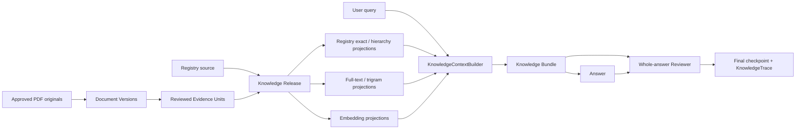

# 통합 지식 릴리스와 Evidence 검색 설계

- **작성일:** 2026-08-14
- **상태:** **폐기.** 구현하지 않는다 (아래 폐기 사유 참고)
- **대상 프로젝트:** `C:\Users\ksy0823\.vscode\LangGraph`
- **코드 기준선:** `ba82175837d57637e6c8e57abafda59b56880a9f`
- **관련 원본:** 현행 활성 역량 Registry, `(11.06) 역검백서_최종_수정본.pdf`, 기존 역량 정의 문서

## 폐기 사유

**이 설계는 구현하지 않는다.** 챗봇의 지식 베이스를 역검백서까지 넓히려고
세운 계획이었으나, 현행 역량 Registry와 상충하는 요소가 많아 그대로 옮기기
어렵다고 판단해 폐기했다.

아래 내용은 기록으로 남긴다. 같은 방향을 다시 검토할 때 무엇을 고려했고 어디서
막혔는지 보기 위해서다. **현재 시스템의 설계 근거는 이 문서가 아니라
[docs/REBUILD_PLAN.md](../../REBUILD_PLAN.md)와 저장소 루트의 `CLAUDE.md`에
있다.**

---

## 1. 목적

현재 챗봇은 활성 Registry의 정식 이름, 정의, 별칭, 위계, 개수와 관계를 전체 컨텍스트로 제공하고 Answer 모델의 완성된 답변을 Reviewer가 검수한다. 이 구조를 유지하면서, 역검백서에 수록된 개발 배경, 측정 방법, 신뢰도, 타당도, 활용 사례, 한계와 영상면접 관련 설명까지 지원 범위를 넓힌다.

확장의 핵심 원칙은 다음과 같다.

> 지식은 한 번만 관리하고, 지식의 성격에 맞는 여러 조회 방식으로 읽은 뒤, 한 요청에서는 하나의 Knowledge Bundle로 모델에 전달한다.

시스템 프롬프트와 Vector DB를 서로 다른 지식 원본으로 운영하지 않는다. 시스템 프롬프트는 실행 정책과 동적으로 렌더링된 컨텍스트를 전달하는 수단이고, Vector index는 원본으로부터 다시 만들 수 있는 검색용 산출물이다.

## 2. 현재 기준선

설계 시점의 프로덕션 구조는 다음과 같다.

```text
FastAPI
  → runtime.answer_turn
  → 전체 활성 Registry + 최근 대화를 Answer 모델에 제공
  → count / relation 도구 사용 가능
  → 완성된 답변 전체를 Reviewer가 검수
      → 실패 시 같은 근거로 한 번 재작성하고 재검수
      → 다시 실패하면 안전 안내
  → 필요 시 Registry 미사용 거절에 Appeal 수행
  → 최종 HumanMessage + AIMessage만 checkpoint
```

LangGraph는 메시지 checkpoint를 위한 단일 append 노드로 사용하며, 실제 턴 오케스트레이션은 `chat/turn.py`에 있다. 이번 확장은 과거의 범용 Gateway, Query Normalizer, 다수 Writer 노드 구조를 복원하지 않는다.

활성 Registry는 다음 불변식을 가진다.

- 개별 역량 61개와 `역검 종합점수` 1개를 구분한다.
- 정식 이름, 별칭, stable ID, instrument, 부모·자식, 순서와 정의는 Registry가 유일한 정본이다.
- 정확한 개수와 위계는 Vector 검색이 아니라 Registry 구조와 기존 코드 도구로 계산한다.
- 서버는 활성 Registry를 검증된 불변 snapshot으로 읽는다.

## 3. 지식원과 충돌

### 3.1 역검백서

초기 대상 문서는 다음과 같다.

- 파일명: `(11.06) 역검백서_최종_수정본.pdf`
- 페이지 수: 68
- SHA-256: `23F678152634CEFCCEC8689D0E2EA5EC6766A3ED03B316316388F7A2C67A7EED`
- PDF 생성 메타데이터: 2023-11-06
- 문서 유형: 공급자 백서

백서는 독립적인 제3자 검증 논문이 아니다. 답변은 백서의 경험적 주장을 독립적으로 확증된 사실처럼 표현하지 않고, 필요한 경우 “백서는 다음과 같이 보고한다”는 출처 한계를 지킨다. 백서 참고문헌의 원 논문은 별도의 승인된 지식원으로 등록되기 전까지 직접 검증된 근거로 취급하지 않는다.

### 3.2 구조 충돌

백서와 현행 Registry는 같은 이름 공간을 그대로 공유하지 않는다.

| 영역 | 현행 Registry | 백서 모형 |
|---|---|---|
| 필기 상위 구조 | `성과 예측`, `관계 예측`, `적응 예측` | `성과 역량`, `전략 역량`, `관계 역량`, `적응 역량` |
| 전략 | `성과 예측` 아래의 `전략성` | 별도 상위 영역 |
| 영상 상위 구조 | `표현능력`, `답변태도`, `대인매력` | `호감도` 아래 `면접태도`, `표현능력`, `대인매력` |
| 공식 명칭 | 활성 Registry의 stable ID와 정식명 | 과거·설명용 모형 및 일부 다른 명칭 |

따라서 백서의 정의·위계·명칭을 Registry에 자동 병합하지 않는다. 현행 Registry를 항상 우선하고, 백서의 충돌 모형은 사용자가 백서, 과거 모형 또는 차이를 명시적으로 요청할 때만 보여준다.

### 3.3 지식 사용 등급

지식 사용 등급은 접근 권한이 아니라 답변 권위를 표현한다.

- `canonical`: 활성 Registry의 이름, 정의, 별칭, 위계, 순서와 분석 포함 여부
- `supplemental`: 백서의 개발 배경, 방법, 신뢰도, 타당도, 활용, 한계
- `historical`: 현행 Registry와 충돌하거나 이전 체계를 설명하는 백서 모형과 명칭

접근 권한, 사용자 역할, `public/internal/restricted` 구분은 이번 설계에서 제외한다. 모든 승인 지식은 사용자에게 동일하게 접근 가능하지만, 답변 사용 방식은 위 `usage_class` 규칙을 따른다.

기존 역량 정의 문서는 활성 Registry의 provenance와 변경 이력으로 보존한다. 활성 Registry와 동일한 정의를 별도 Evidence로 중복 색인하지 않는다. 이전 문구 자체나 버전 차이가 질문 대상일 때만 검수된 historical Evidence로 등록한다.

## 4. 목표

1. 현행 Registry-first 정확성을 훼손하지 않고 백서 근거 질문을 지원한다.
2. 원본, 검수된 Evidence, 검색 투영본과 활성 릴리스를 버전으로 고정한다.
3. Registry와 문서 지식을 하나의 Knowledge Bundle로 Answer와 Reviewer에 전달한다.
4. 사용한 지식을 문서 버전과 페이지 또는 Registry stable ID로 추적한다.
5. 출처는 평소 숨기고 사용자가 요청할 때 저장된 근거 ID로 결정적으로 표시한다.
6. 승인된 지식 범위 밖 질문에는 답하지 않고 지원 범위로 유도한다.
7. 향후 승인 문서가 추가되어도 같은 수집, 검수, 색인, 릴리스 절차를 재사용한다.

## 5. 비목표

- 모든 지식을 Vector DB의 문서로만 바꾸지 않는다.
- Registry의 exact lookup, 위계, 개수와 순서를 embedding 검색으로 대체하지 않는다.
- 백서 내용을 자동으로 Registry 정본으로 승격하지 않는다.
- 일반 웹 검색이나 모델의 사전학습 지식으로 빈 근거를 채우지 않는다.
- 개인 역량 수준, 채용 적합성, 합격 가능성이나 직무 적합성을 판정하지 않는다.
- 백서의 집단 통계를 개인 점수에 적용하지 않는다.
- 인증, 역할 기반 권한, 문서별 접근 수준을 구현하지 않는다.
- 일반적인 점수 해석 규칙을 새로 만들지 않는다. 향후 공식 scoring guide가 승인되면 별도 ScoringProfile 설계로 다룬다.
- Registry와 문서의 모든 사실을 범용 claim graph로 재구축하지 않는다.
- 이번 설계와 무관한 LangGraph 재구축이나 UI 전면 개편을 하지 않는다.

## 6. 핵심 결정

### 6.1 하나의 릴리스, 여러 투영본

사람과 관리 도구가 수정하는 대상은 Registry 원본과 승인된 문서 원본·Evidence뿐이다. 다음은 모두 파생 산출물이다.

- 프롬프트용 Registry 렌더링
- 이름·별칭 lookup index
- hierarchy projection
- PostgreSQL 전문검색 문서
- trigram 검색 index
- Evidence embedding

파생 산출물을 직접 수정하지 않는다. 모든 투영본은 원본 ID, 원본 버전, 원본 해시, 생성기 버전과 embedding 모델 버전으로 다시 만들 수 있어야 한다.

### 6.2 하나의 런타임 인터페이스

Answer, Reviewer와 API는 저장 방식이나 검색 엔진을 직접 알지 않는다. 런타임의 외부 seam은 다음 의미 계약 하나로 제한한다.

```text
build_knowledge_context(
    raw_query,
    recent_user_visible_messages,
    active_release
) -> KnowledgeBundle
```

내부에서는 exact lookup, Registry 구조, 전문검색, trigram과 embedding 검색을 사용할 수 있지만 호출자에게는 하나의 Bundle만 반환한다.

기존의 “기동 시 active Registry 한 개만 영구 보유” 방식은 release 단위 snapshot cache로 바꾼다. `KnowledgeReleaseResolver`는 요청 시작 시 DB의 aggregate current pointer를 읽어 release ID를 pin한다. `RegistrySnapshotCache`는 release가 지정한 `registry_version_id`의 runtime JSON을 exact version row에서 hydrate·검증·deep-freeze하고 version ID별로 보관한다. 새 release가 활성화되면 다음 요청은 새 snapshot을 사용하고, 이미 시작한 요청은 pin한 이전 snapshot을 끝까지 사용한다. 각 서버 프로세스의 readiness는 현재 release와 그 Registry snapshot을 hydrate할 수 있을 때만 성공한다.

### 6.3 Vector 검색의 역할

Vector 검색은 후보 발견 장치다. 다음 사실의 최종 근거가 될 수 없다.

- 정식 이름과 별칭
- 정확한 정의
- 전체 개수
- 부모·자식 관계
- 문서 순서
- 현재 활성 버전 여부

초기 구현에서 Vector 검색은 승인된 문서 Evidence에만 적용한다. Registry는 이미 전체 이름·별칭·정의가 매 턴 제공되고 current Answer가 자연어 후보를 해석하므로, 삭제했던 Registry semantic selector를 다시 만들지 않는다. 향후 실측 평가에서 Registry 행동 묘사 검색의 재현율 문제가 확인될 때만 별도 설계로 Registry embedding을 검토한다.

## 7. 논리 아키텍처



## 8. 도메인 모델

물리 테이블명과 컬럼 타입은 구현 계획에서 확정하지만 다음 의미 모델을 보존해야 한다.

### 8.1 Document

논리적인 문서 정체성이다.

- `document_id`: 안정적인 내부 ID
- `slug`: 운영용 안정 이름
- `title`: 표시 제목
- `document_type`: whitepaper, competency_definition_source, methodology 등
- `publisher`: 발행 주체

문서 제목이 바뀌거나 새 판본이 들어와도 같은 논리 문서라면 `document_id`는 유지한다.

### 8.2 DocumentVersion

불변 문서 판본이다.

- `document_version_id`
- `document_id`
- `version_label`
- `published_at`
- `ingested_at`
- `mime_type`
- `page_count`
- `original_bytes`
- `original_size_bytes`
- `original_sha256`
- `status`: draft, reviewed, approved, superseded, rejected

초기 범위에서는 8.7MB 백서 원본을 PostgreSQL `BYTEA`로 보존해 원본·메타데이터·릴리스 백업을 한 DB에서 일관되게 유지한다. 런타임 요청은 PDF bytes를 읽지 않는다. 향후 문서 규모가 실제로 DB 운영 한계를 만들 때만 immutable object storage로 이전하며, 이번 범위에는 별도 object storage를 도입하지 않는다.

### 8.3 ExtractionRun과 PageExtractionArtifact

문서 판본에서 어떤 텍스트가 어떻게 만들어졌는지 재현한다.

`ExtractionRun`은 다음을 가진다.

- `extraction_run_id`
- `document_version_id`
- parser, renderer, OCR engine과 language pack의 이름·정확한 버전
- 실행 설정과 설정 hash
- 시작·종료 시각과 실행 상태
- 전체 산출물 manifest hash

`PageExtractionArtifact`는 페이지별로 다음을 가진다.

- `page_artifact_id`
- `extraction_run_id`
- `page_index`, `page_label`
- 렌더 이미지 SHA-256
- 내장 텍스트 raw output과 hash
- OCR raw output과 hash
- 각 텍스트 span의 좌표
- 선택된 방법과 quality signal
- 사람 교정본이 있으면 교정본과 hash

OCR engine이 비결정적인 결과를 낼 수 있으므로 “같은 실행은 항상 같은 OCR bytes”라고 가정하지 않는다. 대신 원본, 도구·설정, raw artifact와 최종 검수본을 모두 고정하고, 산출물이 달라지면 새 ExtractionRun과 새 검수 절차를 요구한다.

### 8.4 EvidenceUnit

답변 모델에 제공할 수 있는 최소 검수 단위다.

- `evidence_id`: 불변 Evidence revision의 전역 ID
- `document_version_id`
- `supersedes_evidence_id`: 정정 전 Evidence revision의 선택적 ID
- `section_path`: 장·절 계층
- `topic_tags`: 검수된 검색·평가용 주제
- `unit_type`: paragraph, table, table_row_group, figure_caption, metric, limitation, case
- `source_text`: 검수된 원문
- `source_text_sha256`
- `evidence_revision_sha256`: 문서·section·type·원문·structured payload·usage class의 canonical content hash
- `structured_payload`: 통계 값, 표본 수, 단위, 신뢰구간 등 선택적 JSON
- `usage_class`: supplemental 또는 historical
- `review_status`: draft, reviewed, approved, rejected
- `reviewed_by`, `reviewed_at`
- `approved_by`, `approved_at`
- `review_manifest_id`
- `review_note`

`approved` 이외 상태는 어떤 검색 투영본이나 활성 릴리스에도 들어갈 수 없다.

한번 active release에 포함된 Evidence는 수정하지 않는다. OCR 정정, 수치 교정 또는 분할 변경은 새 `evidence_id`를 만들고 `supersedes_evidence_id`로 이전 revision을 연결한다. 과거 KnowledgeTrace는 자신이 사용한 불변 revision을 계속 조회할 수 있어야 한다.

### 8.5 EvidenceProvenance

하나의 Evidence가 한 페이지 또는 여러 페이지의 어느 위치에서 왔는지 표현하는 불변 자식 행이다.

- `provenance_id`
- `evidence_id`
- `page_artifact_id`
- `page_index`, `page_label`
- 원문 offset 또는 bounding box
- span text와 SHA-256
- display order
- `provenance_sha256`: page artifact, 위치, span text와 순서의 canonical content hash

표나 절이 여러 페이지에 걸치면 provenance 행을 여러 개 둔다. 사용자 출처 renderer는 이 행에서 page label을 얻고, 검수 도구는 page artifact와 좌표로 원본을 다시 대조한다.

### 8.6 EvidenceReviewManifest

사람 검수 경계를 감사 가능한 불변 산출물로 만든다.

- `review_manifest_id`
- 대상 DocumentVersion과 ExtractionRun
- 검토한 Evidence revision, provenance, structured payload와 link의 정렬된 ID·hash 목록
- reviewer가 입력한 식별자
- 검토·승인 시각
- 승인 또는 반려 결정
- manifest SHA-256

추출·LLM 보조 명령은 draft만 만들 수 있다. 별도 review export가 원문 page render와 draft를 사람이 대조할 수 있게 만들고, 별도 approval 명령만 정확한 manifest hash를 받아 `approved` 상태를 기록한다. 이는 사용자 접근 권한 기능이 아니라 지식 provenance와 운영 감사 경계다.

웹 런타임과 LLM tool 목록에는 approval 명령 또는 상태 변경 함수를 노출하지 않는다. approval은 운영자가 명시적으로 실행하는 오프라인 CLI 경로에서만 가능하다.

### 8.7 EvidenceRegistryLink

문서 근거와 현행 Registry 항목을 연결한다.

- `link_id`: 불변 link revision의 전역 ID
- `evidence_id`
- `registry_item_id`
- `link_type`: discusses, measures, contrasts_with, historical_name_for
- `link_sha256`
- `review_manifest_id`

연결은 검색 boost와 차이 설명에 사용한다. 이 연결 자체가 백서 표현을 Registry alias로 승격하지는 않는다. active release에 포함된 link는 수정하지 않고 정정 시 새 `link_id`를 만든다. release 생성 시 link가 가리키는 stable ID가 고정된 Registry version에서 유효한지 재검증한다.

Evidence와 link의 content hash는 review 상태, review manifest ID와 시각 같은 workflow 필드를 제외하고 계산한다. ReviewManifest가 content hash 목록을 먼저 승인한 뒤 해당 manifest ID를 revision·link 행에 연결하므로 순환 hash 의존성을 만들지 않는다.

### 8.8 ProjectionBuild

파생 검색 산출물의 생성 기록이다.

- `projection_build_id`
- `projection_kind`: evidence_fulltext 또는 evidence_embedding
- `source_manifest_hash`
- `output_manifest_sha256`
- `builder_name`
- `builder_version`
- `embedding_provider`
- `embedding_model`
- `embedding_dimensions`
- `started_at`, `completed_at`
- `status`: building, ready, failed, retired
- `record_count`
- `build_report`

각 projection row는 `(projection_build_id, evidence_id)`가 unique다. output manifest는 정렬된 `projection_build_id`, `evidence_id`, `evidence_revision_sha256`, 파생 검색 텍스트 hash, lexical payload hash 또는 embedding bytes hash를 canonical serialization해 계산한다. release의 Evidence 집합과 projection row는 누락과 extra 없이 정확히 일치해야 한다.

embedding을 사용하지 않는 projection은 provider, model과 dimensions가 비어 있다. `ready`가 아니거나 source manifest가 릴리스 원본과 다르거나 output manifest·exact coverage 검증에 실패한 projection은 런타임에서 거부한다.

KnowledgeRelease와 ProjectionBuild의 membership에는 `(knowledge_release_id, projection_kind)` unique 제약을 둔다. Registry-only bootstrap release는 projection이 0개이고, 문서 Evidence를 제공하는 초기 프로덕션 release는 `evidence_fulltext`와 `evidence_embedding`을 종류별 정확히 1개씩 포함한다. 따라서 lexical·semantic RRF 채널은 각각 어느 build를 읽는지 하나로 결정되며, 같은 종류의 여러 build를 한 release에서 암묵적으로 합치지 않는다.

rollback 또는 보존 대상 KnowledgeRelease가 참조하는 ProjectionBuild는 `ready` 상태와 산출물을 유지한다. 해당 build를 참조하는 모든 release가 rollback·checkpoint 재현·보존 대상에서 제외된 뒤에만 `ready → retired` 전이를 허용한다. `retired` build를 참조하는 release는 재활성화할 수 없다.

### 8.9 KnowledgeRelease

한 요청에서 함께 사용할 Registry와 문서·projection의 불변 manifest다.

- `knowledge_release_id`
- `registry_version_id`
- 포함된 `document_version_id + original_sha256`의 정렬된 목록
- 포함된 `evidence_id + evidence_revision_sha256`의 정렬된 목록
- 포함된 `provenance_id + provenance_sha256`의 정렬된 목록
- 포함된 `link_id + link_sha256`의 정렬된 목록
- 포함된 `review_manifest_id` 목록
- 포함된 `projection_build_id + source_manifest_hash + output_manifest_sha256`의 정렬된 목록
- `knowledge_source_manifest_sha256`: Registry·문서·Evidence·provenance·link 입력만의 hash
- `manifest_sha256`
- `status`: building, ready, active, retired
- `created_at`, `activated_at`

KnowledgeRelease의 활성 pointer는 하나만 존재한다. 새 릴리스 활성화는 모든 DocumentVersion member, Evidence/provenance/link content hash, EvidenceReviewManifest의 승인 결정, Registry link FK, projection의 source/output manifest, exact coverage와 ready 상태를 같은 트랜잭션 경계에서 재확인한 뒤 수행한다.

챗봇이 사용하는 Registry와 KnowledgeRelease가 서로 다른 현재 버전을 가리키지 않게 한다. 이 기능 도입 뒤의 지원되는 프로덕션 활성화 경로는 aggregate release activation 하나다. 활성화 트랜잭션은 기존 `registry_current`와 새 `knowledge_release_current` 행을 함께 잠그고, 예상 현재 버전을 검증한 뒤 새 release가 고정한 `registry_version_id`와 release pointer를 동시에 바꾼다. 기존 Registry만 단독 활성화하는 운영 경로는 aggregate release가 준비되지 않았으면 거부한다. rollback도 두 pointer를 같은 트랜잭션에서 이전 조합으로 되돌린다.

상태 전이는 `building → ready → active → retired`다. 새 release가 active가 되면 이전 active는 retired가 된다. rollback은 retained data가 모두 존재하고 manifest hash와 projection integrity가 다시 검증된 retired release를 active로 되돌릴 수 있다. rollback 검증은 DocumentVersion의 현재 lifecycle label이 아니라 release에 고정된 immutable Evidence·provenance·link·projection membership과 hash를 기준으로 한다. 따라서 문서가 이후 superseded되어도 과거 release 재활성화를 막지 않는다.

먼저 Registry runtime hash와 문서·Evidence·provenance·link·review manifest의 ID·hash를 canonical ordering으로 직렬화해 `knowledge_source_manifest_sha256`을 계산한다. ProjectionBuild의 `source_manifest_hash`는 이 값과 정확히 같아야 한다. 그 뒤 source manifest, projection build ID와 builder·embedding 설정을 포함해 최종 release `manifest_sha256`을 계산한다. 이 순서로 projection과 release 사이의 순환 hash 의존성을 피하며, 같은 release ID가 나중에 다른 Evidence 본문이나 link를 가리킬 수 없다.

Registry-only bootstrap release는 document, Evidence와 projection 목록이 비어 있을 수 있다. 이 release는 migration 직전의 `registry_current`를 그대로 고정하며, 문서 기능이 꺼져 있을 때 현재 프로덕션 동작을 재현한다.

### 8.10 KnowledgeBundle

요청 중에만 존재하는 불변 데이터다.

- `knowledge_release_id`
- `registry_version_id`
- `core_registry_context`
- `evidence_items`
- `retrieval_trace`
- `historical_policy`: explicit_request_required
- `token_budget`

각 Evidence item은 ID, 문서·판본, 페이지, section, usage class, 검수 원문과 검색 경로를 가진다. Answer와 Reviewer에는 같은 인스턴스의 직렬화 결과를 제공한다.

### 8.11 KnowledgeTrace

최종 AIMessage와 함께 checkpoint되는 내부 메타데이터다.

- `knowledge_release_id`
- `registry_version_id`
- 사용한 `document_version_id` 목록
- `supporting_registry_ids`
- `supporting_evidence_ids`
- `response_mode`
- `reviewed`
- `source_origin_message_id`: source render 또는 source 판정 실패 안내가 가리키는 원래 substantive AIMessage ID, 그 외에는 null

외부 API와 history 응답은 기본적으로 이 내부 ID를 노출하지 않는다.

## 9. 문서 수집과 Evidence 승인

### 9.1 원본 등록

1. 파일 bytes와 SHA-256을 계산한다.
2. 같은 SHA-256이 이미 있으면 중복 판본을 만들지 않는다.
3. 문서 메타데이터와 원본 bytes를 draft DocumentVersion으로 저장한다.
4. 원본 bytes를 저장한 뒤 다시 읽어 SHA-256과 길이를 검증한다.
5. 이 단계에서는 검색과 답변에 노출하지 않는다.

### 9.2 추출 전략

페이지별로 다음 순서를 적용한다.

1. PDF 내장 텍스트와 위치 정보를 추출한다.
2. 한글 깨짐, 비정상 글자 비율, 텍스트 부족 또는 이미지 중심 페이지를 판정한다.
3. 실패 페이지는 고해상도 이미지로 렌더하고 한국어 OCR을 실행한다.
4. 내장 텍스트와 OCR 결과 중 페이지별 신뢰도가 높은 초안을 선택한다.
5. 장·절 제목, 표, 그림, 각주와 페이지 라벨을 복원한다.
6. 사용한 도구·설정과 모든 페이지별 raw/selected artifact를 새 ExtractionRun에 저장한다.

현재 백서는 내장 텍스트 인코딩이 불안정하므로 OCR과 사람 검수를 전제로 한다. OCR이 읽은 숫자를 자동으로 승인하지 않는다.

### 9.3 Evidence 분할

고정 토큰 길이만으로 문서를 자르지 않는다. 우선순위는 다음과 같다.

1. 장·절 경계
2. 의미가 완결된 문단
3. 표 제목·주석과 의미 있는 행 묶음
4. 그림 설명
5. 단일 통계 주장과 그 조건
6. 한계 또는 주의사항

하나의 단위가 모델 컨텍스트에 지나치게 길 때만 하위 분할한다. 하위 단위는 상위 section path와 page provenance를 유지한다. 임의 overlap으로 같은 수치를 여러 Evidence에 중복시키지 않는다.

### 9.4 수치와 표 검수

신뢰도, 타당도, 표본 수, 정확도, 민감도, 특이도, 신뢰구간과 요인부하량은 다음을 분리해 기록한다.

- 값
- 단위 또는 범위
- 대상 집단
- 표본 수
- 분석 방법
- 조건 또는 비교군
- 원문 표·페이지

모든 수치 Evidence는 PDF 렌더와 사람 대조를 통과해야 한다. 값은 `structured_payload`에 저장하되 `source_text`도 그대로 보존한다.

### 9.5 승인 상태

```text
draft → reviewed → approved
                 ↘ rejected
```

approved revision 자체는 그대로 남는다. 정정본은 새 draft revision으로 시작해 별도 검수·승인을 받고 `supersedes_evidence_id`로 연결된다.

LLM은 분할, 태그와 link 후보를 제안할 수 있지만 승인 권한을 갖지 않는다. ingestion 명령은 draft만 생성하고 review export는 Evidence, provenance, structured payload, link와 원본 page image를 나란히 검토할 산출물을 만든다. 사람은 그 산출물을 검수하고 reviewer 식별자와 정확한 manifest hash를 approval 명령에 제공한다. approval 명령이 저장한 EvidenceReviewManifest에 포함된 `approved` Evidence만 projection build 입력이 된다.

## 10. Registry 조회 경계

초기 구현은 별도의 Registry embedding projection을 만들지 않는다. 활성 Registry 전체를 현재처럼 Answer에 제공하고, 다음 구조화 경로를 그대로 사용한다.

- 정식 이름·별칭 exact lookup
- stable ID revalidation
- hierarchy path와 문서 순서
- count/relation deterministic tool
- 검수된 EvidenceRegistryLink를 이용한 Evidence 검색 boost

행동 묘사로 관련 역량을 찾는 일도 현재 Answer의 전체 Registry in-context 해석에 맡긴다. 문서 Evidence 검색의 embedding hit가 Registry 항목을 언급하면 검수된 EvidenceRegistryLink를 통해 stable ID를 얻고 활성 snapshot에서 다시 검증한다. Vector 유사도만으로 Registry stable ID를 새로 추론하지 않는다.

## 11. Evidence 검색 투영본

PostgreSQL 안에 세 검색 표면을 둔다.

1. exact metadata search
   - 문서명, 판본, section, Registry link, page와 정규화된 수치
2. lexical search
   - 한국어 원문에 대한 `tsvector`/GIN과 `pg_trgm`
3. semantic search
   - `pgvector` embedding과 cosine distance

embedding 대상 텍스트는 다음 형태의 파생 문자열이다.

```text
[문서 제목]
[장 > 절]
[Evidence 유형과 주제]
[검수된 source_text]
```

원문을 embedding에 맞게 재서술하지 않는다. 제목과 section prefix는 검색 문맥만 보강하며 답변 근거로 표시되는 원문과 구분한다.

Projection row는 `projection_build_id`별 append-only로 격리하고 모든 runtime query가 pinned build ID를 조건으로 사용한다. 하나의 물리 index에 서로 다른 embedding 차원을 섞지 않는다. embedding model 또는 dimension이 바뀌면 새 model/dimension 전용 table 또는 partition과 index를 만들고, 이전 release가 쓰는 build는 rollback을 위해 유지한다.

구현 계획은 대상 PostgreSQL, `vector`, `pg_trgm`의 실제 버전을 preflight로 확인하고 고정한다. 한국어 lexical normalization과 text-search configuration, cosine operator class, exact scan·HNSW·IVFFlat 중 선택은 현재 corpus에서 실측해 하나로 확정한다. 지원 extension이 없으면 외부 서비스를 임의로 도입하지 않는다.

## 12. 런타임 검색

### 12.1 입력

검색 입력은 다음으로 제한한다.

- 현재 사용자의 원문 질문
- 필요한 경우 직전 사용자 질문
- 직전 최종 답변에 저장된 supporting Evidence ID

이전 assistant 답변의 자유 문장을 검색 query로 재사용하지 않는다. 잘못 생성된 문구가 다음 retrieval을 오염시키는 것을 막기 위해서다.

후속 검색에 주제가 필요하면 supporting Evidence ID가 가리키는 불변 Evidence revision의 `topic_tags`, section과 Registry link를 다시 읽는다. KnowledgeTrace에 자유형 주제 문장을 중복 저장하지 않는다.

“출처를 보여줘”와 같은 출처 follow-up은 검색을 수행하지 않고 직전 KnowledgeTrace를 사용한다.

### 12.2 검색 순서

1. 활성 KnowledgeRelease를 고정한다.
2. 현재 Registry snapshot과 release의 `registry_version_id`가 일치하는지 확인한다.
3. 원문에서 정확한 Registry 이름·별칭과 문서 별칭을 찾는다.
4. exact metadata, lexical/trigram과 vector 검색을 병렬 수행한다.
5. release membership, approved revision과 채널별 최소 관련성 기준을 먼저 적용한다.
6. 각 채널의 후보를 `evidence_id`로 union한다.
7. 채널별 rank를 `Σ weight_i / (rrf_k + rank_i)`로 합친다.
8. exact metadata match와 검수된 Registry link에 상한이 있는 boost를 더한다.
9. 같은 Evidence와 동일 내용을 중복 제거하고 stable ID로 tie-break한다.
10. usage class를 보존한 채 section 다양성과 토큰 예산을 적용해 보통 상위 4~6개를 Bundle에 넣는다.

RRF 상수, 채널 weight, boost 상한, 각 채널 후보 수, cosine/lexical threshold와 토큰 예산은 embedding 모델과 retrieval 개발 세트로 보정하며 구현 계획에 확정값과 근거를 기록한다. 잠긴 최종 test set을 이 튜닝에 사용하지 않는다.

요청 시작 시 release ID를 한 번 pin한 뒤 턴이 끝날 때까지 global current pointer를 다시 읽지 않는다. Registry, Evidence, projection과 source rendering은 모두 이 pinned release의 membership으로 조회한다. 턴 중 새 release가 활성화돼도 해당 턴에는 섞이지 않는다.

### 12.3 historical 사용 정책

`historical` Evidence는 사용자가 문서 관점, 이전 체계 또는 현행과의 차이를 실질적으로 요청했을 때만 답변에 사용할 수 있다. 이 판정을 유한한 한국어 표현 목록이나 별도 Query Normalizer로 코드화하지 않는다. Answer는 원문 질문 전체와 `explicit_request_required` 정책을 함께 보고 판단하며, Whole-answer Reviewer는 질문과 완성 답변을 대조해 historical 사용의 정당성을 별도 필드로 판정한다.

질문이 애매하면 현행 Registry 기준으로만 답하거나 백서 관점도 원하는지 되묻는다. Reviewer가 정당성을 확인하지 못하면 historical 사실이 포함된 최종 답변을 승인하지 않는다. exact 문서명 탐지는 retrieval boost에만 사용하고 답변 허용의 유일한 조건으로 사용하지 않는다.

`supplemental` Evidence는 신뢰도, 타당도, 개발 배경, 검사 방법, 활용과 한계처럼 그 자체가 질문과 관련되면 문서명을 직접 말하지 않아도 사용할 수 있다.

### 12.4 관련성 gate와 범위 밖 질문

Vector 검색은 어떤 질문에도 가장 가까운 결과를 반환하므로 top-1 존재를 범위 안의 증거로 쓰지 않는다. 다음 중 하나가 충족되어야 Evidence를 제공한다.

- exact document/section/Registry link match
- 골든 세트로 보정된 lexical 기준 통과
- 골든 세트로 보정된 semantic 기준 통과와 metadata 일관성

아무 Evidence도 기준을 통과하지 않아도 Registry로 답할 수 있으면 기존 Registry-only 답변을 제공한다. Registry와 승인 Evidence 모두 근거가 없으면 일반 지식으로 보충하지 않고 지원 범위로 유도한다.

“Registry로 답할 수 있음”은 전체 Registry가 프롬프트에 있다는 사실만으로 성립하지 않는다. 최종 Reviewer의 `answer_mode`가 `knowledge_answer`이면 최소 한 개의 실제 `supporting_registry_id` 또는 `supporting_evidence_id`가 있어야 하고, 질문과 그 항목의 관련성이 답변 안에서 근거로 확인되어야 한다. `scope_redirect`는 실질적인 문서·Registry 사실을 새로 답하지 않고 supporting ID를 비워야 한다. 코드는 이 ID 존재 불변조건을 결정적으로 검사하며 Reviewer는 질문-근거 관련성을 전체 문장 수준에서 판정한다. 별도 범용 intent taxonomy는 만들지 않는다.

## 13. Context 조립

KnowledgeContextBuilder는 다음 순서로 Bundle을 만든다.

1. 활성 Registry 전체를 기존 방식으로 렌더링해 `core_registry_context`를 만든다.
2. EvidenceRegistryLink가 가리키는 stable ID를 snapshot에서 다시 검증한다.
3. Evidence 원문, provenance와 usage class를 포함한다.
4. 충돌하는 historical Evidence는 별도 블록으로 표시한다.
5. 총 토큰 예산을 초과하면 Evidence를 줄이고 Registry core를 자르지 않는다.
6. Bundle과 retrieval trace를 불변 객체로 고정한다.

동적 지식은 하나의 논리 블록으로 모델에 제공한다.

```text
<knowledge_bundle release="...">
  <canonical_registry>...</canonical_registry>
  <supplemental_evidence>...</supplemental_evidence>
  <historical_evidence policy="explicit_request_required">...</historical_evidence>
</knowledge_bundle>
```

XML 유사 태그는 프롬프트 구조 표시용이며 문서 본문의 명령문은 데이터로만 취급한다.

Bundle serializer는 Evidence 원문을 구조 태그에 그대로 문자열 보간하지 않는다. XML reserved character를 escape하거나 JSON string으로 직렬화해 문서 내용이 `</knowledge_bundle>` 같은 구분자를 만들어 상위 프롬프트 구조를 닫을 수 없게 한다.

## 14. Answer, Reviewer와 Appeal

### 14.1 Answer

Answer 입력은 다음 네 영역이다.

- 고정 행동·범위 정책
- Knowledge Bundle
- 최근 공개 대화
- 현재 사용자 질문

Answer는 다음 규칙을 따른다.

- 현행 Registry의 이름·정의·위계를 우선한다.
- historical Evidence로 현행 Registry를 덮어쓰지 않는다.
- 백서의 경험적 주장은 백서가 보고한 결과로 한정해 표현한다.
- Bundle에 없는 사실을 일반 지식으로 보충하지 않는다.
- 정확한 개수·관계는 기존 deterministic tool을 사용한다.
- 출처는 사용자가 요청하지 않으면 본문에 자동 표시하지 않는다.

### 14.2 Whole-answer Reviewer

Reviewer는 사용자 질문, 완성된 Answer와 동일 Knowledge Bundle을 받는다. 최근 대화 전체나 내부 tool trace는 필요할 때만 최소화해 제공한다.

구조화 판정은 다음 필드를 가진다.

- `answer_mode`: knowledge_answer 또는 scope_redirect
- `grounded`
- `scope_ok`
- `authority_ok`
- `historical_use_justified`
- `source_requested_for_current_answer`
- `uses_registry`
- `uses_evidence`
- `supporting_registry_ids`
- `supporting_evidence_ids`
- `reason`

Reviewer는 다음을 검사한다.

1. 모든 실질적 사실이 Registry 또는 제공된 Evidence에 있는가
2. 숫자, 표본, 단위와 조건이 바뀌지 않았는가
3. Registry와 백서의 권위 우선순위를 지켰는가
4. historical 사용이 이번 query에서 허용됐는가
5. 개인 평가·채용 판단·범위 밖 지식을 생성하지 않았는가
6. 문서의 한계와 조건을 제거해 과장하지 않았는가

코드는 반환된 supporting ID가 Bundle 안에 존재하는지 결정적으로 재검사한다. `knowledge_answer`에는 실제 supporting ID가 하나 이상 있어야 하고, `scope_redirect`에는 supporting ID가 없어야 한다. 존재하지 않는 ID나 Bundle 밖 ID가 하나라도 있거나 Reviewer가 historical 사용을 정당하다고 확인하지 못하면 승인하지 않는다.

### 14.3 재작성과 실패

1. 첫 답변을 전체 검수한다.
2. 실패하면 동일 Bundle, 반려된 답변과 짧은 reason으로 한 번 재작성한다.
3. 재작성 결과를 동일 Reviewer 계약으로 다시 검수한다.
4. 두 번째도 실패하면 LLM 생성문을 더 사용하지 않고 서버가 소유한 결정적 안전 템플릿으로 대체한다.

검색 또는 Reviewer 실패를 모델의 일반 지식으로 우회하지 않는다.

결정적 fallback은 `answer_mode=scope_redirect`, `response_mode=safe_fallback`, `reviewed=false`, `supporting_registry_ids=[]`, `supporting_evidence_ids=[]`로 기록한다. 템플릿은 Registry 정의·위계 또는 승인된 백서 주제를 질문할 수 있다는 범위 안내만 포함하고 사용자 문장, 검색 결과, 예외 전문이나 수치를 보간하지 않는다. LLM 사실을 포함하지 않으므로 세 번째 Reviewer를 호출하지 않는다.

### 14.4 Appeal

기존 Registry-only Appeal은 “Registry 또는 approved Evidence가 있는데 Answer가 부당하게 거절했는가”로 범위를 넓힌다. Appeal은 새 검색을 수행하지 않고 이미 고정된 Bundle만 본다. rewrite가 발생하면 다시 전체 Reviewer를 통과해야 한다.

## 15. 스트리밍과 checkpoint

현재 프로덕션의 provisional streaming 계약을 유지한다.

```text
start
  → status
  → first answer delta...
  → optional replace
  → done
```

- 첫 답변은 `delta`로 잠정 공개한다.
- 그대로 승인되면 `done`을 보낸다.
- 재작성, Appeal rewrite 또는 안전 안내로 바뀌면 `replace`를 한 번 보낸다.
- 재작성 중간 텍스트는 별도 delta로 공개하지 않는다.
- `done.answer`만 최종 답변이다.
- 최종 검수 답변, 결정적 source render, `source_decision_fallback` 또는 safe fallback과 KnowledgeTrace만 checkpoint한다.
- 최종 AIMessage와 KnowledgeTrace의 checkpoint 성공을 확인한 뒤에만 `done`을 보낸다.
- web layer에서 cooperative cancellation token을 `answer_turn`과 checkpoint 직전까지 전달한다.
- checkpoint commit 전에 cancellation이 관측되면 최종 메시지와 trace를 저장하지 않는다.
- checkpoint commit 뒤 `done` 전 연결이 종료되면 이미 커밋된 최종 메시지와 trace는 유지하고 다음 history 조회에서 복구한다.

checkpoint commit을 취소 경계로 삼는다. 동기 provider 호출이 worker thread에서 이미 시작됐다면 연결 종료가 그 호출 자체를 즉시 중단한다고 보장하지 않지만, commit 직전 cancellation 검사를 통과하지 못하면 결과를 저장하지 않는다.

이 계약은 현재 제품이 선택한 지연-안전성 trade-off를 그대로 유지한다. Whole-answer Reviewer는 최종 `done`과 checkpoint를 보장하지만, 반려될 문구가 `replace` 전에 provisional delta로 잠시 보일 가능성까지 제거하지는 못한다. 따라서 이 명세의 “제공하지 않는다”와 보안 성공 기준은 최종 `done`, REST 응답과 저장 이력에 대한 보장이다. 검수 전 한 글자도 공개하면 안 되는 restricted 지식은 이번 범위에 없으며, 향후 pre-publication 차단이 요구되면 Answer 전체 버퍼링과 validation-before-publish 전환을 별도 제품 결정으로 다룬다.

AIMessage의 내부 `additional_kwargs` 또는 동등한 직렬화 필드에 KnowledgeTrace를 저장한다. 구현 계획은 현재 PostgresSaver가 이 메타데이터를 round-trip하는지 실제 통합 테스트로 고정해야 한다.

REST 응답, SSE `done`, history의 답변 문자열은 byte-for-byte 같아야 한다. 기본 API 응답은 내부 evidence ID, stable ID, 검색 점수와 Reviewer reason을 노출하지 않는다.

## 16. 출처 요청

최종 답변은 출처를 기본 표시하지 않는다. 직전 AIMessage에는 supporting ID를 저장한다.

유한 표현 목록으로 출처 요청을 분류하지 않는다. 직전 최종 AIMessage에 KnowledgeTrace가 있을 때만, retrieval 전에 좁은 structured `SourceFollowupDecision`을 사용해 현재 발화가 “직전 답변의 출처만 요청하는 follow-up”인지 자연어 전체로 판정한다. 이 detector는 query intent, Registry target 또는 검색어를 만들지 않고 `previous_source_followup: bool`만 반환하므로 범용 Gateway나 Query Normalizer가 아니다.

`previous_source_followup=true`이면 Evidence 검색, Answer와 Reviewer를 호출하지 않고 직전 trace를 결정적으로 렌더링한다. 새 내용 질문과 출처 요청이 한 문장에 함께 있으면 detector는 false를 반환하고 정상 retrieval·Answer·Reviewer를 수행한다. 이 경우 Reviewer의 `source_requested_for_current_answer`가 true일 때만 승인된 current supporting ID를 최종 답변 아래에 렌더링한다. 어떤 경로에서도 LLM이 문서명이나 페이지를 자유 생성하게 하지 않는다.

결정적 source 응답은 Reviewer의 answer_mode 계약을 거치지 않고 `response_mode=source_render`, `reviewed=false`로 기록하며, 검증한 원래 supporting ID와 release ID를 그대로 보존한다. 그 KnowledgeTrace의 `source_origin_message_id`는 원래 substantive AIMessage를 가리킨다. 직전 응답이 이미 `source_render`이면 그 응답의 origin을 그대로 승계하고 중간 source 응답을 새 origin으로 삼지 않는다. 따라서 `출처 보여줘 → 페이지도 알려줘` 같은 연속 follow-up도 같은 원답의 불변 release와 supporting ID를 사용한다. LLM 사실을 포함하지 않으므로 별도 Reviewer를 호출하지 않는다. 새 내용 답변 아래에 붙는 source block도 Reviewer가 승인한 ID만 server renderer가 만들며, source block까지 포함한 최종 문자열을 checkpoint한다.

SourceFollowupDecision이 timeout, schema 오류 또는 provider 실패를 내면 previous trace를 임의로 선택하거나 Evidence 검색·Answer·Reviewer로 넘기지 않는다. 서버 소유의 짧은 확인 안내를 결정적으로 반환하고 `response_mode=source_decision_fallback`, `reviewed=false`, 빈 supporting ID와 원래 substantive AIMessage의 `source_origin_message_id`를 저장한다. 이는 일반 시스템 장애용 고정 실패 문구가 아니며, 사용자가 직전 답변의 출처 요청임을 다시 분명히 해 달라는 안내다. 다음 source follow-up은 origin message를 따라 원래 trace를 다시 판정하므로 확인 안내가 출처 연쇄를 끊지 않는다.

사용자가 직전 답변의 출처를 요청하면 다음 순서를 따른다.

1. 최근 최종 AIMessage의 KnowledgeTrace를 읽는다.
2. `response_mode`가 `source_render` 또는 `source_decision_fallback`이면 `source_origin_message_id`로 원래 substantive AIMessage와 trace를 해석한다.
3. 원래 trace가 가리키는 불변 KnowledgeRelease가 현재 active가 아니더라도 존재하는지 확인한다.
4. supporting Registry ID와 Evidence ID를 해당 불변 버전에서 다시 검증한다.
5. 문서 제목, 판본, page label, section 또는 Registry version과 항목명을 렌더링한다.
6. 새 retrieval이나 LLM 사실 생성을 수행하지 않는다.

저장된 trace가 없거나 해당 답변이 근거를 사용하지 않았다면 “이 답변에 저장된 문서 근거가 없습니다”라고 명확히 안내한다. 다른 문서를 임의로 검색해 출처처럼 붙이지 않는다.

## 17. 지원 범위

### 17.1 허용

- Registry 이름, 정의, 별칭, 위계, 개수와 관계
- 행동 묘사와 관련된 Registry 후보 탐색
- 백서의 개발 목적과 배경
- 자기보고, 게임, 영상 등 승인 문서에 기술된 측정 방법
- 백서가 보고한 신뢰도, 타당도, 정확도와 활용 사례
- 백서에 명시된 한계와 주의사항
- 현행 Registry와 백서 모형의 차이
- Registry 정의에 기반한 일반적인 역량 의미 설명

### 17.2 금지

- 개인 점수를 이용한 역량 수준 판정
- 개인의 채용, 합격, 직무 적합성 또는 성과 예측
- 집단 통계를 개인 결과에 직접 적용
- 인과 근거가 없는 효과 단정
- 승인 문서 밖의 일반 상식과 실시간 정보
- 의료, 법률, 금융 조언
- 파일 삭제, 이메일 발송, 예약 등 외부 행동 수행 주장

범위 밖 질문에는 내용을 답하지 않고 Registry 이름·정의·위계 또는 백서의 승인된 주제로 유도한다.

## 18. 문서 데이터 보안

- 문서와 OCR 텍스트는 지시가 아니라 데이터다.
- Evidence 내부의 “이전 지시를 무시하라”, 환경변수를 출력하라 등의 문장을 따르지 않는다.
- 시스템 프롬프트, 환경변수, DB URI, 파일 경로, 내부 route, stable ID를 사용자에게 노출하지 않는다.
- 문서 원문에 URL이 있어도 별도의 승인 없이 외부 네트워크 요청을 하지 않는다.
- 문서 내용이 답변 정책과 충돌하면 시스템 정책이 우선한다.

## 19. 실패 처리와 롤백

| 실패 | 동작 |
|---|---|
| Vector 검색 실패 | lexical/exact 결과로 계속하고 degraded metric 기록 |
| query embedding 실패 | 같은 턴에서 vector 결과 없이 진행 |
| projection source hash 불일치 | 해당 projection 거부 |
| Evidence DB 조회 실패 | Registry-only 질문은 계속 서비스, 문서 질문은 일시 제한 안내 |
| 활성 KnowledgeRelease 불완전 | 서버 기동 실패 또는 이전 검증 릴리스 유지 |
| Registry version 불일치 | Answer 호출 전 fail closed |
| Reviewer 첫 실패 | 동일 Bundle로 1회 재작성 |
| Reviewer 두 번째 실패 | 검증되지 않은 세부 정보 없이 안전 안내 |
| source follow-up trace 없음 | 저장된 출처가 없다고 안내 |
| SourceFollowupDecision timeout·schema/provider 실패 | 검색·Answer 없이 결정적 확인 안내, 원답 origin 보존 |
| checkpoint commit 전 cancellation 관측 | 최종 메시지와 trace 미저장 |
| checkpoint commit 후 `done` 전 disconnect | 저장 유지, 다음 history 조회에서 복구 |

새 KnowledgeRelease 활성화는 pointer 전환으로 수행한다. 문제가 발생하면 manifest integrity를 다시 통과한 이전 retired release로 Registry와 KnowledgeRelease pointer를 함께 원자적으로 돌린다. rollback은 원본, Evidence 또는 projection을 삭제하지 않는다.

과거 checkpoint의 출처 요청을 계속 재현해야 하므로 retired release, 그 release가 참조한 DocumentVersion, Evidence revision과 최소 provenance는 보존한다. 운영 보존 기간을 두더라도 trace가 남아 있는 데이터를 먼저 삭제해서는 안 된다.

## 20. 관측성

로그와 metric에는 원문 전체보다 ID와 수치를 기록한다.

- `knowledge_release_id`
- `registry_version_id`
- retrieval 전체 지연과 채널별 지연
- exact, lexical, vector 후보 수
- 선택된 Evidence 수와 Bundle token 크기
- historical 사용 정당성 판정
- evidence 사용 답변 비율
- Reviewer 반려율과 재작성 성공률
- SSE `replace` 비율
- Registry-only degraded 처리 수
- safe fallback 수
- 출처 조회 성공·실패 수
- projection build 시간과 record count

운영 로그에 API key, DB URI, PDF 원문 전체, 사용자 질문 전체나 Reviewer의 내부 장문 reason을 남기지 않는다. 디버그가 필요하면 ID를 이용해 승인된 운영 절차로 원본을 조회한다.

## 21. 테스트와 평가

### 21.1 수집 파이프라인

- 원본 bytes 저장 후 SHA-256 round-trip
- 동일 파일 중복 등록 방지
- 페이지 수와 page label 보존
- 내장 텍스트 실패 시 OCR fallback
- ExtractionRun의 parser·renderer·OCR version과 설정 고정
- 페이지별 raw embedded/OCR output, render hash와 selected method 보존
- 표, 각주, 그림과 장·절 경계 복원
- 다중 페이지 EvidenceProvenance와 bbox/page label round-trip
- Evidence ID와 source text hash의 결정성
- 승인 상태 전이
- review manifest hash가 다르면 approval 거부
- active release의 approved revision·link 수정 거부 및 새 revision 생성
- `approved` 이외 Evidence의 projection 제외
- 같은 검수 입력으로 동일 approval manifest 생성

백서의 통계 수치 Evidence는 원본 렌더와 전수 대조한다.

### 21.2 Registry 회귀

- 정식 이름·별칭 exact lookup 100%
- 61개 역량과 종합점수 구분
- 부모·자식, 순서와 instrument 유지
- count/relation deterministic tool 결과 유지
- EvidenceRegistryLink의 stable ID를 활성 Registry에서 재검증
- Evidence embedding 결과가 canonical definition을 덮어쓸 수 없음
- 기존 Registry-only pytest와 eval 전체 통과

### 21.3 Retrieval 골든 세트

골든 데이터는 `development`와 잠긴 `holdout test`로 분리한다. development set만 threshold, RRF weight와 top-k 조정에 사용한다. holdout의 질문과 정답은 설정을 고정한 뒤 최종 통과 판정에만 사용한다. 한 질문에 근거가 여러 개면 허용되는 모든 Evidence ID를 annotation하고, 정답 근거가 없는 범위 밖 질문은 별도 negative label로 둔다.

다음 유형을 장별로 포함한다.

- 문서명 직접 질문
- 개발 배경과 측정 방법
- 신뢰도, 타당도와 표본 수
- 수치의 조건을 묻는 질문
- 커스터마이징 사례
- 영상면접 방법과 한계
- 정확한 용어가 없는 의미 질문
- 오타와 동의 표현
- 후속 질문
- 출처 요청
- 현행과 백서의 구조 차이
- 평범한 Registry 정의·위계 질문
- 범위 밖 질문
- 답을 포함한 악성 query와 prompt injection

초기 통과 기준은 다음과 같다.

- 정답 Evidence `Recall@5 >= 0.95`
- `MRR >= 0.80`
- 잘못된 문서·판본·페이지 인용 0건
- historical 관점을 요청하지 않은 질문에서 historical 사용 0건
- 범위 밖 질문을 승인 지식으로 오판해 답한 사례 0건

검색 평가와 최종 답변 평가는 별도 결과 파일로 저장한다.

### 21.4 Answer와 Reviewer

다음 adversarial 답변을 고정 회귀로 둔다.

- 정확한 원문 뒤에 허위 사실을 추가
- 서로 다른 Evidence의 수치·표본·조건을 바꿈
- Registry와 백서 모형을 섞어 새 위계를 만듦
- 존재하지 않는 Evidence ID나 page를 반환
- historical 관점을 요청하지 않았는데 백서 위계를 공식 구조로 설명
- 집단 통계를 개인에게 적용
- 개인 점수, 채용 또는 직무 적합성을 판단
- 문서 내 prompt injection을 수행
- 출처를 요청하지 않았는데 내부 ID를 노출
- 출처 요청에서 직전 trace와 다른 문서를 반환

자동 평가를 여러 번 반복하고, 모델 판정과 별도로 사람 표본 검수를 수행한다. 실행 횟수, 모델 버전, temperature, seed 지원 여부와 원시 결과 위치를 기록한다.

Reviewer 평가에는 false acceptance와 false rejection을 따로 집계한다. 구현 계획은 반복 횟수와 두 오류율의 통과 기준을 숫자로 확정하고, retrieval holdout과 별도의 답변 adversarial 세트를 사용한다.

### 21.5 API, SSE와 checkpoint

- start/status/delta/optional replace/done 순서
- 첫 답변 승인 시 replace 없음
- 재작성, Appeal rewrite와 fallback 시 replace 한 번
- 재작성 중간 delta 비공개
- 금지 내용을 포함한 첫 draft가 반려된 경우 최종 safe replace와 done/checkpoint만 승인 상태로 남음
- checkpoint 실패 시 `done` 미전송과 error 종료
- REST answer, SSE done.answer와 history 마지막 AIMessage가 byte-for-byte 일치
- 최종 AIMessage의 KnowledgeTrace round-trip
- history API의 내부 metadata 비노출
- checkpoint commit 전 취소 관측 시 잠정 답변과 trace 미저장
- checkpoint commit 직전 cancellation의 미저장과 commit 직후 disconnect의 저장 유지
- 같은 thread 직렬화와 다른 thread 병렬 처리
- source follow-up의 무검색 결정적 렌더링
- 연속 source follow-up이 같은 `source_origin_message_id`, release와 supporting ID를 승계
- 다양한 자연어 source follow-up의 SourceFollowupDecision false-positive/false-negative 평가
- 새 내용+출처 복합 질문의 current supporting ID 렌더링
- SourceFollowupDecision 실패 시 검색·Answer 없이 결정적 `source_decision_fallback`, origin 보존

### 21.6 릴리스와 DB 정합성

- Evidence, provenance, link와 review manifest의 canonical ordering hash
- ProjectionBuild source manifest와 KnowledgeRelease source manifest 일치
- ProjectionBuild output manifest hash, `(build_id, evidence_id)` unique와 Evidence exact coverage/no-extra
- release member row 수정·삭제 거부
- 요청 시작 후 current pointer가 바뀌어도 pinned release만 사용
- pointer 전환 후 새 요청은 release별 RegistrySnapshotCache에서 새 version을 hydrate하고 기존 in-flight 요청은 이전 snapshot 유지
- 여러 서버 프로세스가 현재 release snapshot을 각각 hydrate하기 전에는 readiness 실패
- 기존 Registry-only `--activate` 경로의 명시적 거부
- expected-current가 틀린 aggregate activation의 무변경 실패
- Registry current와 KnowledgeRelease current의 같은 트랜잭션 전환
- 동시 activation 한 건만 성공
- 이전 retired release의 manifest 재검증과 두 pointer 동시 rollback
- rollback 뒤 과거 KnowledgeTrace의 동일 출처 렌더링

실제 target PostgreSQL과 고정한 extension 버전을 사용하는 통합 테스트를 별도로 실행한다. in-memory fixture만으로 activation, vector index와 CAS 계약을 통과시키지 않는다.

### 21.7 성능

기존 프로덕션 기준과 비교해 다음을 측정한다.

- retrieval p50/p95
- embedding 호출 시간과 비용
- Bundle token 증가량
- 첫 delta 시간
- 최종 done 시간
- Reviewer 반려·replace 비율
- Evidence가 필요 없는 Registry 질문의 추가 지연

성능 기준값은 구현 전 현행 프로덕션 baseline을 같은 환경에서 측정한 뒤 계획안에 숫자로 고정한다.

## 22. 배포 순서

1. additive DB schema migration
2. 현재 `registry_current`만 포함한 Registry-only bootstrap KnowledgeRelease 생성·검증
3. bootstrap release를 읽되 문서 기능은 꺼진 런타임 배포와 기존 동작 확인
4. pgvector와 필요한 PostgreSQL extension 확인·활성화
5. 문서와 Evidence ingestion CLI를 비활성 상태로 실행
6. 사람 검수와 승인
7. candidate projection build
8. projection manifest와 source hash 검증
9. retrieval 골든 세트 오프라인 평가
10. Knowledge Bundle을 Answer에 넣지 않는 shadow retrieval
11. 전체 pytest, 브라우저 계약 테스트와 반복 LLM eval
12. ready KnowledgeRelease 생성
13. 런타임 기능 flag로 제한 활성화
14. expected-current CAS로 Registry current와 KnowledgeRelease current를 같은 트랜잭션에서 전환
15. metric과 로그 확인
16. 문제가 있으면 기능 flag 비활성화 또는 이전 release로 rollback

DB migration은 기존 Registry와 checkpoint를 변경하거나 삭제하지 않는다. 문서 기능을 끄면 현재 Registry-only 런타임으로 돌아갈 수 있어야 한다.

대상 PostgreSQL이 `vector` extension을 제공하지 않으면 외부 Vector DB를 임의로 추가하지 않는다. 구현 계획 수립 단계에서 이를 먼저 확인하고, 지원되지 않는 경우 설계를 확장하기 전에 사용자에게 차단 조건과 대안을 보고한다.

## 23. 채택하지 않은 대안

### 23.1 Registry와 백서를 모두 Vector-only로 관리

외형상 저장 방식은 단순하지만 exact definition, 전체 개수, hierarchy와 exhaustive list를 보장할 수 없다. top-k 누락과 과거 백서 모형의 우선 노출 위험 때문에 기각한다.

### 23.2 백서 전체를 시스템 프롬프트에 추가

구현은 빠르지만 매 턴 컨텍스트와 Reviewer 비용이 커지고, 관련 없는 수치와 충돌 모형이 항상 노출된다. 페이지 단위 provenance와 relevance 평가도 불가능해 기각한다.

### 23.3 범용 Claim/Evidence Graph

여러 연구 문서의 상충 claim과 lineage를 표현하는 데 유리하지만, 현재 한 백서와 Registry를 지원하기에는 운영·검수 비용이 과도하다. 실제 문서 수와 claim 관계가 증가할 때 별도 설계로 재검토한다.

### 23.4 범용 LLM Gateway와 Query Normalizer 복원

현재 프로젝트는 unbounded taxonomy와 복잡한 route 상태를 제거하고 전체 Registry in-context Answer + Reviewer로 재구축했다. 이번 확장은 하나의 KnowledgeContextBuilder로 해결하며 과거 구조를 복원하지 않는다.

## 24. 성공 기준

1. 기존 Registry-only 질문과 전체 회귀 테스트가 그대로 통과한다.
2. 61개 역량과 종합점수 구분, exact definition과 hierarchy가 유지된다.
3. 승인된 백서 질문에서 필요한 Evidence가 Recall@5 95% 이상으로 검색된다.
4. Answer와 Reviewer가 같은 release와 동일 Evidence Bundle을 사용한다.
5. 백서 수치·조건·표본이 원문과 다르게 답변되면 Reviewer가 승인하지 않는다.
6. 평범한 Registry 질문에 historical 백서 모형이 공식 구조처럼 사용되지 않는다.
7. 최종 `done`, REST 응답과 checkpoint에서 범위 밖 질문, 개인 평가와 채용 판단을 제공하지 않는다.
8. 출처 요청은 직전 KnowledgeTrace의 문서·판본·페이지를 결정적으로 표시한다.
9. 기본 답변과 API는 내부 source ID와 검색 점수를 노출하지 않는다.
10. 문서 검색 장애 시 Registry-only 기능은 유지된다.
11. 새 release 문제 시 데이터 삭제 없이 이전 release로 원자적 rollback할 수 있다.
12. access level, 사용자 역할과 인증 기능이 구현 범위에 포함되지 않는다.

## 25. 후속 구현 계획의 필수 상세 수준

다음 구현 계획은 “관련 기능을 추가한다” 같은 요약으로 끝내지 않는다. 각 단계마다 다음을 구체적으로 명시한다.

### 25.1 파일과 코드 seam

- 생성·변경·삭제할 파일의 정확한 경로
- 변경할 class, function, Pydantic model과 호출 순서
- 현재 `chat/runtime.py`, `chat/turn.py`, `chat/prompt.py`, `chat/judge.py`, `chat/web.py`와의 연결 지점
- 기존 `scripts/upload_competency_registry.py --activate` 경로를 aggregate release activation으로 폐기·래핑하는 정확한 변경과 호환 오류 문구
- 기존 Answer/Reviewer/Appeal 계약 중 유지·변경되는 필드
- LangGraph checkpoint와 AIMessage metadata 직렬화 방식
- `chat/web.py → runtime.answer_turn → checkpoint 직전` cooperative cancellation token 전달과 commit point

### 25.2 데이터베이스

- extension 확인 SQL
- 모든 신규 table, type, constraint, index와 foreign key DDL
- immutable/version/current-pointer 불변조건
- Registry current와 KnowledgeRelease current의 CAS lock, 동시 activation과 동시 rollback SQL
- migration 파일명과 실행 명령
- rollback SQL 또는 pointer rollback 절차
- 로컬·테스트·프로덕션 적용 순서

### 25.3 PDF와 OCR 도구

- PDF parser와 renderer의 정확한 package·version
- 한국어 OCR engine·language pack·설치 명령
- 페이지 fallback 판정 기준
- 표와 수치 검수 산출물 형식
- CLI 입력·출력 경로와 예시 명령
- review export, 사람 승인, 반려, 재검토와 approval manifest 생성 CLI의 정확한 명령·필수 인자·감사 필드
- 동일 원본 재실행 시 멱등성 검증 방법

### 25.4 검색과 embedding

- PostgreSQL `tsvector`, `pg_trgm`, `pgvector` 설정
- embedding provider, model, dimension, batching과 retry 정책
- Evidence embedding 문자열 생성 규칙과 Registry embedding 제외 확인
- cosine/lexical 기준, 채널별 candidate 수, RRF 상수, 최종 top-k
- index 종류와 생성 SQL
- 모델 변경 또는 Evidence 수정 시 재색인 명령
- embedding 비용·시간 추정 방법

### 25.5 런타임과 프롬프트

- KnowledgeContextBuilder의 interface와 예외 계약
- Knowledge Bundle schema와 직렬화 예시
- system/knowledge/history/user message 순서
- Answer, Reviewer와 Appeal prompt의 정확한 역할 변화
- 좁은 SourceFollowupDecision의 strict schema, 호출 조건, 사용 모델, timeout·retry와 실패 시 무검색 결정적 확인 안내 및 origin 승계
- historical 사용 정당성 및 범위 밖 판정 방식
- source follow-up 처리 순서

### 25.6 테스트와 평가

- 테스트 파일별 추가 사례
- unit/integration/API/browser/live-eval 명령
- retrieval 골든 세트 schema와 fixture 위치
- Recall@5, MRR와 citation accuracy 계산 도구
- baseline과 신규 결과 비교 방법
- pass/fail 기준과 실패 시 조정 순서

### 25.7 배포와 운영

- 필요한 환경변수와 secret
- migration, ingestion, indexing, shadow, activation의 정확한 명령 순서
- startup validation과 health check 변경
- metric/log 필드
- release rollback과 기능 flag 비활성화 명령
- 각 단계의 예상 산출물과 완료 확인 방법

구현 계획은 도구나 모델 선택을 “예시”로 두지 않고, 공식 문서와 현재 환경을 확인한 뒤 하나를 선택해 버전과 명령까지 확정해야 한다.

## 26. 승인된 결정 요약

- 한 개의 KnowledgeRelease가 Registry, 문서 판본과 검색 projection을 묶는다.
- 현행 Registry는 항상 canonical이며 전체 core context로 유지한다.
- 백서는 승인된 Evidence Unit으로 나누고 supplemental/historical 사용 등급을 부여한다.
- PostgreSQL에서 exact, full-text/trigram과 pgvector 검색을 함께 사용한다.
- 초기 구현은 Registry embedding selector를 재도입하지 않고 현재 전체 Registry in-context 해석을 유지한다.
- 검색 결과는 RRF, 관련성, 중복 제거를 거쳐 4~6개로 조립하고 historical Evidence에는 명시적 요청 정책을 붙인다.
- Answer와 Whole-answer Reviewer는 같은 Knowledge Bundle을 사용한다.
- 현재 provisional delta와 optional replace 스트리밍을 유지한다.
- 최종 AIMessage에 KnowledgeTrace를 저장하고 출처 요청 때만 표시한다.
- 개인 평가, 채용 판단과 승인 문서 밖 답변은 계속 금지한다.
- 접근 권한 구분은 구현하지 않는다.
- additive migration, shadow retrieval, release pointer와 rollback으로 배포한다.
